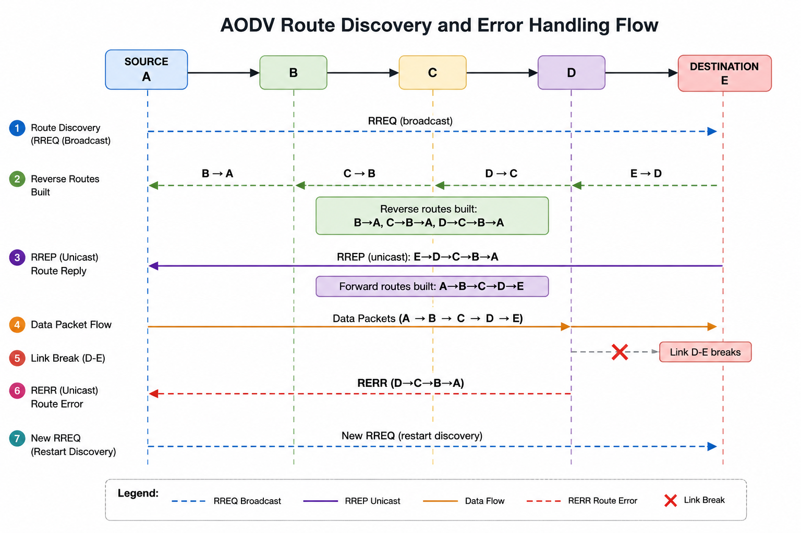
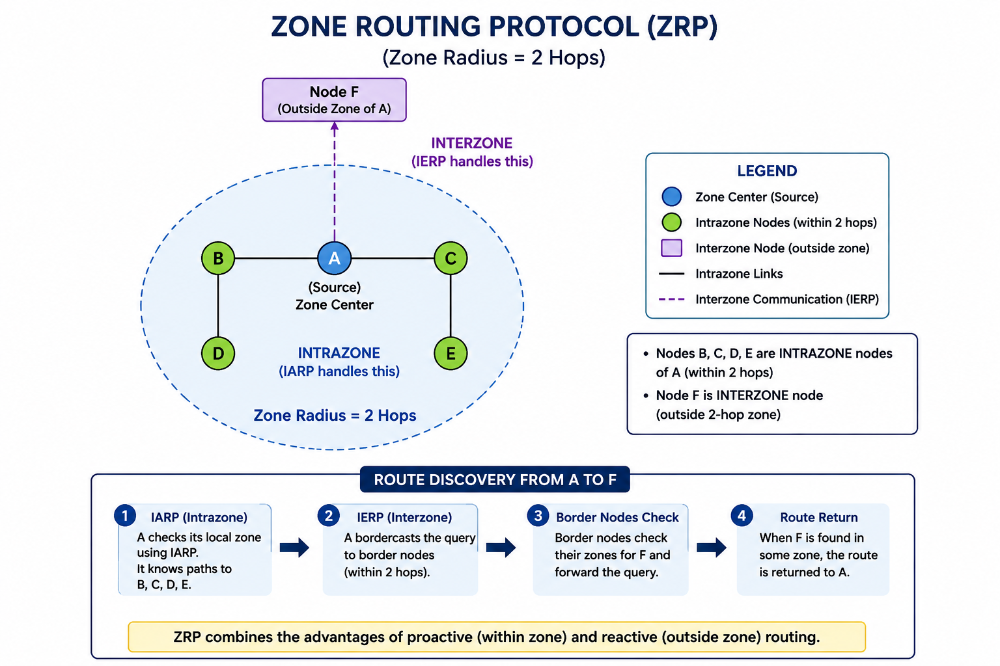
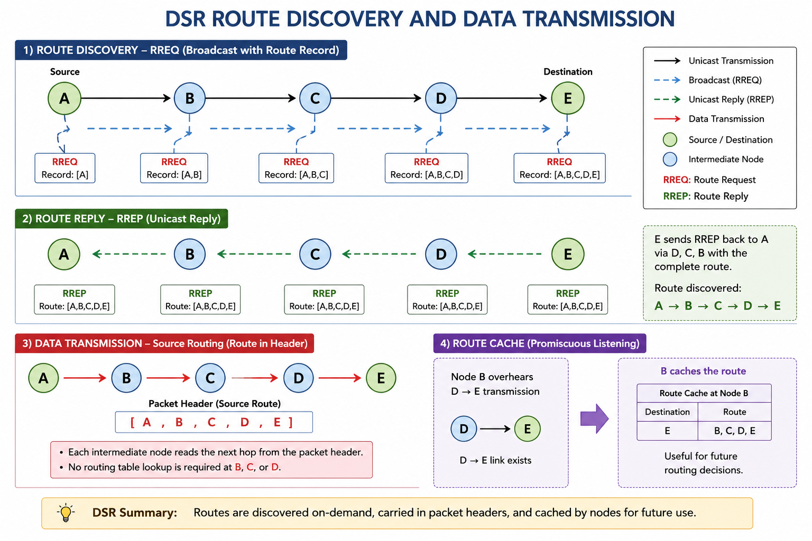

# UNIT :3

---

# Important Questions Covered

1. Compare Proactive Routing Protocols with Reactive Routing Protocols
2. How does AODV route data? What are its advantages and disadvantages?
3. What is Hybrid Routing? Explain Zone Routing Protocol (ZRP) with suitable diagram
4. Compare MANET and VANET
5. List and explain the applications of MANET
6. Explain DSR (Dynamic Source Routing) — how it routes data, advantages and disadvantages

---

# Q1(a). Compare Proactive Routing Protocols with Reactive Routing Protocols

## Introduction

Routing protocols in **MANET (Mobile Ad-hoc Network)** are classified into three types: **Proactive (Table-Driven)**, **Reactive (On-Demand)**, and **Hybrid**. The fundamental difference lies in *when* and *how* routes are discovered and maintained.

---

## Main Answer

### Proactive (Table-Driven) Routing

- Nodes **continuously maintain routing tables** for all possible destinations.
- Routes are **pre-computed** and stored before any data transmission.
- **Examples:** DSDV (Destination Sequenced Distance Vector), OLSR (Optimized Link State Routing).
- Periodic **control message broadcasts** update routing tables across all nodes.
- Route is **immediately available** when data needs to be sent.
- Consumes **more bandwidth and battery** due to constant updates.

### Reactive (On-Demand) Routing

- Routes are **discovered only when needed** — triggered by data transmission.
- No pre-maintained routing tables; routes are **computed on-demand**.
- **Examples:** AODV (Ad-hoc On-Demand Distance Vector), DSR (Dynamic Source Routing).
- Route discovery involves **flooding RREQ** (Route Request) packets.
- **Lower overhead** but introduces **route discovery delay**.
- More suitable for **sparse and highly mobile** networks.

---

## Comparison Table

| Parameter | Proactive Routing | Reactive Routing |
|---|---|---|
| **Route Maintenance** | Continuously maintained (always up-to-date) | Created on-demand (only when needed) |
| **Routing Table** | Pre-computed for all destinations | No table; computed per request |
| **Bandwidth Overhead** | High (periodic updates consume bandwidth) | Low (control packets only on demand) |
| **Route Discovery Delay** | No delay — route instantly available | Delay due to RREQ/RREP flooding |
| **Battery Consumption** | High (constant broadcasting drains battery) | Low (less overhead saves power) |
| **Scalability** | Poor (overhead grows with network size) | Better for large, sparse networks |
| **Suitability** | Low-mobility, stable networks | High-mobility, dynamic networks |
| **Examples** | DSDV, OLSR, WRP | AODV, DSR, TORA |
| **Memory Usage** | High (maintains full routing table) | Low (stores only active routes) |
| **Stale Routes** | Possible (node moves before update) | Less likely (route freshly computed) |

---

## Diagram

```
PROACTIVE ROUTING                    REACTIVE ROUTING
=====================                =====================

 t=0  All nodes exchange             t=0  No route exists
      routing tables                      (tables empty)
       |                                   |
       v                                   v
 t=1  A knows route to              t=1  A needs to send
      B, C, D, E                         data to E
       |                                   |
       v                                   v
 t=2  A sends data to E             t=2  A floods RREQ
      (route ready!)                      broadcast
       |                                   |
       v                                   v
 t=3  Periodic updates              t=3  E sends RREP
      continue even if                    back to A
      no data is sent                      |
                                           v
                                    t=4  Route established
                                         Data sent

OVERHEAD: HIGH (always)             OVERHEAD: LOW (on need)
```

*Figure: Proactive vs Reactive Routing — Route Discovery Timeline*

---

## Example

**Proactive Example (DSDV):**
- Node A maintains a table: `{B: via B, C: via B→C, D: via D, E: via D→E}`
- When A wants to send to E, it looks up the table — no waiting.

**Reactive Example (AODV):**
- Node A wants to send data to E (unknown route).
- A floods RREQ → intermediate nodes forward it → E replies with RREP → route stored temporarily.

---

## Conclusion

**Proactive routing** is preferred in **low-mobility, delay-sensitive** applications where immediate route availability is critical. **Reactive routing** is better for **highly mobile, bandwidth-constrained** MANETs where minimizing overhead is the priority.

---

# Q1(b). How does AODV Route Data? What are its Advantages and Disadvantages?

## Introduction

**AODV (Ad-hoc On-Demand Distance Vector)** is a **reactive (on-demand) unicast routing protocol** for MANETs. It was developed by **C. E. Perkins and E. M. Royer** and is defined in **RFC 3561**. AODV discovers routes only when required, uses **sequence numbers** to avoid loops, and discards stale routes automatically.

---

## Main Answer

### AODV Message Types

| Message | Full Form | Purpose |
|---|---|---|
| **RREQ** | Route Request | Broadcast by source to find destination |
| **RREP** | Route Reply | Unicast reply from destination/intermediate node |
| **RERR** | Route Error | Notifies source about broken links |
| **HELLO** | Hello Message | Periodic neighbor detection beacon |

---

### AODV Route Discovery Process (Step-by-Step)

#### Phase 1 — Route Request (RREQ)

1. **Source node A** wants to send data to **Destination E** but has no route.
2. A creates an **RREQ packet** containing:
   - Source IP, Source Sequence Number
   - Destination IP, Destination Sequence Number
   - Broadcast ID (unique per RREQ)
3. A **broadcasts RREQ** to all neighbors.
4. **Intermediate nodes** (B, C, D) forward RREQ if it is fresh (not seen before).
5. Each intermediate node creates a **reverse route** back to source A.
6. Duplicate RREQs (same Source IP + Broadcast ID) are **discarded**.

#### Phase 2 — Route Reply (RREP)

1. **Destination E** (or an intermediate node with a fresh enough route to E) receives RREQ.
2. E generates an **RREP packet** containing:
   - Destination IP, Destination Sequence Number
   - Hop Count (distance to destination)
   - Lifetime (how long the route is valid)
3. RREP is sent **unicast** back along the reverse path to A.
4. Intermediate nodes update their **forward route table** toward E as RREP passes.

#### Phase 3 — Data Transmission

1. Source A receives RREP and **installs the route** to E.
2. **Data packets** are forwarded along the established path.
3. Route entries have a **lifetime** — they expire if unused.

#### Phase 4 — Route Error (RERR)

1. If a **link breaks** (node moves away / fails), the detecting node sends **RERR**.
2. RERR propagates upstream toward source A.
3. Source A must **restart route discovery** if it needs to continue sending data.

---

## Diagram

```
        AODV ROUTE DISCOVERY

SOURCE A                                     DESTINATION E
   |                                               |
   |--- RREQ (broadcast) ----->                    |
   |                    B ---> C ---> D ---> E     |
   |                    |      |      |      |     |
   |  (Reverse routes   |      |      |      |     |
   |   built: B→A,      |      |      |      |     |
   |   C→B→A, D→C→B→A) |      |      |      |     |
   |                                               |
   |<-- RREP (unicast: E→D→C→B→A) ----------------|
   |     (Forward routes built: A→B→C→D→E)         |
   |                                               |
   |===== DATA PACKETS (A → B → C → D → E) ======>|
   |                                               |
   | [Link D-E breaks]                             |
   |<-- RERR (D→C→B→A) ------                      |
   |                                               |
   |--- New RREQ (restart discovery) ----------->  |


Legend:
  ---> RREQ Broadcast
  <--- RREP Unicast
  ====> Data Flow
  RERR Route Error

```

*Figure: AODV Route Discovery and Error Handling Flow*


*Figure: AODV Route Discovery and Error Handling Flow*
---

### Advantages of AODV

1. **On-Demand Route Discovery** — No unnecessary route maintenance; saves bandwidth.
2. **Loop-Free Routing** — Uses **sequence numbers** to ensure freshness and avoid routing loops.
3. **Unicast, Multicast, Broadcast Support** — Supports all traffic types.
4. **Self-Healing** — Automatically detects broken links via RERR and rediscovers routes.
5. **Scales to Large Networks** — Lower overhead compared to proactive protocols in large MANETs.
6. **No Source Routing** — Route stored in routing tables; packet headers remain small.
7. **Sequence Numbers** — Prevent stale routes and count-to-infinity problem.

### Disadvantages of AODV

1. **Route Discovery Latency** — Initial delay before data can be sent (RREQ flooding takes time).
2. **RREQ Flooding Overhead** — Flooding consumes bandwidth; causes **broadcast storm** in dense networks.
3. **Intermediate Node Vulnerability** — Intermediate nodes can reply with stale routes if sequence numbers are misconfigured.
4. **Not Suitable for Low-Latency Applications** — The discovery delay makes it poor for real-time voice/video in highly mobile networks.
5. **Route Breaks in High Mobility** — Frequent RERR messages and re-discovery in fast-moving nodes.
6. **No QoS Support** — AODV does not natively support Quality of Service guarantees.

---

## Example

**Scenario:** Military field operation — 5 soldiers (A, B, C, D, E) with mobile devices.

- Soldier A wants to send a command to Soldier E.
- A broadcasts RREQ → B forwards → C forwards → D forwards → E receives.
- E sends RREP unicast: E→D→C→B→A.
- A sends encrypted command data via A→B→C→D→E.
- If Soldier D moves out of range, RERR is sent to A, and A rediscovers route.

---

## Conclusion

**AODV** is one of the most widely used MANET routing protocols due to its **on-demand nature, loop-free guarantee via sequence numbers, and self-healing capability**. It is standardized in RFC 3561 and is the foundation for many modern wireless mesh network implementations.

---

# Q1(c). What is Hybrid Routing? Explain Zone Routing Protocol (ZRP) with Diagram

## Introduction

**Hybrid Routing** combines the advantages of both **proactive (table-driven)** and **reactive (on-demand)** routing. It uses proactive routing **within a defined zone** and reactive routing **between zones**. The most well-known hybrid protocol is **ZRP (Zone Routing Protocol)** proposed by **Haas and Pearlman (1997)**.

---

## Main Answer

### What is Hybrid Routing?

- **Proactive routing:** efficient for nearby destinations (no discovery delay).
- **Reactive routing:** efficient for far destinations (avoids excessive table maintenance).
- **Hybrid routing:** uses proactive within a "zone" and reactive beyond it.
- Goal: **reduce control overhead** while maintaining **low latency for local traffic**.

---

### Zone Routing Protocol (ZRP)

ZRP divides the network into **overlapping zones** centered at each node.

#### Key Concepts

| Concept | Description |
|---|---|
| **Zone** | All nodes within **radius r hops** from a node form its zone |
| **Zone Radius (r)** | Configurable parameter; determines zone size |
| **Intrazone Nodes** | Nodes within the zone radius |
| **Interzone Nodes** | Nodes outside the zone radius |
| **IARP** | IntrAzone Routing Protocol — proactive within zone |
| **IERP** | IntErzone Routing Protocol — reactive between zones |
| **BRP** | Bordercast Resolution Protocol — queries border nodes |

#### ZRP Sub-Protocols

**1. IARP (IntrAzone Routing Protocol)**
- Proactively maintains routes to all nodes **within the zone**.
- Each node knows the exact path to every node within r hops.
- Uses periodic updates like DSDV/OLSR within zone.
- Reduces scope of proactive updates (only zone, not entire network).

**2. IERP (IntErzone Routing Protocol)**
- Reactively discovers routes to nodes **outside the zone**.
- Uses **bordercasting** — queries border nodes of the zone first.
- Border nodes are nodes at exactly **r hops** from source.
- Each border node checks its own zone for the destination.
- If found, the route is returned; otherwise, their border nodes are queried.

**3. BRP (Bordercast Resolution Protocol)**
- Handles the **interzone query propagation**.
- Prevents duplicate queries using **query detection** mechanism.
- Uses coverage lists to avoid re-querying already-covered nodes.

---

## Diagram

```
         ZONE ROUTING PROTOCOL (ZRP) — ZONE RADIUS = 2 HOPS

                        +-----------+
                        |   Node F  | <-- Outside Zone of A
                        +-----------+
                              |
             INTERZONE    (IERP handles this)
             ─────────────────────────────────────────────
             INTRAZONE    (IARP handles this)
                              |
         +----+         +-----+-----+         +----+
         | B  |---------| A (Source)|---------|  C |
         +----+         +-----+-----+         +----+
           |            Zone Center                |
           |        (Zone Radius r = 2)            |
         +----+                               +----+
         | D  |                               | E  |
         +----+                               +----+

   Nodes B, C, D, E = INTRAZONE nodes of A (within 2 hops)
   Node F = INTERZONE node (outside 2-hop zone)

   ┌─────────────────────────────────────────────────────┐
   │  A wants to reach F:                                │
   │  1. IARP: A already knows paths to B, C, D, E      │
   │  2. IERP: A bordercasts to border nodes (2 hops)   │
   │  3. Border nodes check THEIR zones for F            │
   │  4. Route returned when F is found in some zone     │
   └─────────────────────────────────────────────────────┘
```

*Figure: Zone Routing Protocol — Intrazone (IARP) and Interzone (IERP)*

---

### Advantages of ZRP

1. **Reduced Overhead** — Proactive updates limited to zone; not entire network.
2. **Low Latency for Local Traffic** — Intrazone routes instantly available.
3. **Scalable** — Suitable for both small and large MANETs by tuning zone radius.
4. **Flexible Zone Radius** — r can be adjusted based on network density and mobility.
5. **No Duplicate Discovery** — BRP prevents re-querying already-covered regions.

### Disadvantages of ZRP

1. **Zone Radius Tuning** — Choosing optimal r is difficult and network-dependent.
2. **Overlapping Zone Overhead** — Adjacent zones may repeatedly exchange the same information.
3. **IARP Maintenance Cost** — Proactive updates within zone still consume bandwidth.
4. **Complex Implementation** — Three sub-protocols (IARP, IERP, BRP) increase complexity.

---

## Example

**Scenario:** University campus MANET

- r = 2 hops for all nodes.
- Student A (node A) wants to reach Professor F in another building.
- Within A's zone: A knows paths to B, C, D, E (classrooms nearby) via IARP.
- For Professor F (outside zone): A uses IERP — bordercasts to border nodes D and E.
- D's zone includes F. D replies with the route.
- Full path: A → D → F established.

---

## Conclusion

**ZRP** elegantly combines the strengths of proactive and reactive routing. By confining proactive maintenance to a local zone and using reactive discovery beyond it, ZRP achieves **better scalability, lower overhead, and reduced route discovery latency** compared to purely proactive or reactive protocols.

---

# Q2(a). Compare MANET and VANET

## Introduction

**MANET (Mobile Ad-hoc Network)** and **VANET (Vehicular Ad-hoc Network)** are both infrastructure-less wireless networks. However, they differ significantly in node type, mobility patterns, applications, and challenges. VANET is essentially a specialized subset of MANET optimized for vehicular environments.

---

## Main Answer

### MANET — Overview

- A **self-organizing, infrastructure-less** wireless network of mobile devices.
- Nodes: **laptops, smartphones, PDAs, sensors**.
- Used in: disaster recovery, military, conferences, IoT.
- Nodes move **randomly** in any direction and at any speed.

### VANET — Overview

- A specialized MANET where nodes are **vehicles (cars, buses, trucks)**.
- Nodes: **On-Board Units (OBU) in vehicles + Road-Side Units (RSU)**.
- Used in: **traffic management, collision avoidance, road safety, infotainment**.
- Nodes move in **constrained patterns** defined by roads and traffic rules.

---

## Comparison Table

| Parameter | MANET | VANET |
|---|---|---|
| **Full Form** | Mobile Ad-hoc Network | Vehicular Ad-hoc Network |
| **Node Type** | Laptops, PDAs, smartphones, sensors | Vehicles (cars, trucks) + RSUs |
| **Mobility Pattern** | Random, unpredictable movement | Constrained by roads, traffic rules |
| **Node Speed** | Low to moderate (walking/running) | High speed (0–200 km/h) |
| **Infrastructure** | Fully infrastructure-less | Can use RSU (Road Side Units) as partial infra |
| **Network Topology** | Frequently changing, unpredictable | Changes rapidly but follows road maps |
| **Energy Constraint** | Battery-powered; energy is limited | Powered by vehicle engine; less constrained |
| **Communication Types** | Node-to-Node only | V2V (Vehicle-to-Vehicle), V2I (Vehicle-to-Infrastructure) |
| **Coverage Area** | Limited (indoor, campus, field) | Large (city-wide, highway) |
| **Primary Application** | Military, disaster recovery, IoT, conferences | Traffic safety, collision avoidance, navigation |
| **Routing Protocol** | AODV, DSR, DSDV, ZRP | GPSR, VADD, DREAM, GeoDTN+Nav |
| **Link Duration** | Moderate | Very short (high speed causes rapid disconnection) |
| **Scalability Challenge** | Moderate | High (dense urban traffic = thousands of nodes) |
| **Security Concern** | Moderate | High (safety-critical; rogue vehicles are dangerous) |
| **QoS Requirement** | Moderate | Very high (life-safety applications) |

---

## Diagram

```
                    MANET vs VANET

┌─────────────────────┐      ┌─────────────────────┐
│        MANET        │      │        VANET        │
├─────────────────────┤      ├─────────────────────┤
│  Laptop ─ Phone     │      │ Car ─ Car ─ Car     │
│     │       │       │      │  │           │      │
│  Tablet ─ PDA       │      │ RSU         RSU     │
│     │               │      │  │           │      │
│  Sensor Node        │      │ Traffic   Emergency │
│                     │      │ Control   Vehicle   │
├─────────────────────┤      ├─────────────────────┤
│ Random Mobility     │      │ Road-Constrained    │
│ Any Direction       │      │ Fixed Road Paths    │
│ Indoor / Campus     │      │ City / Highway      │
│ Low-Medium Speed    │      │ High Speed Vehicles │
└─────────────────────┘      └─────────────────────┘
```

*Figure: MANET vs VANET — Node Types and Mobility*

---

## Example

- **MANET:** Rescue team communicating in an earthquake zone using mobile phones without cellular network.
- **VANET:** Cars on a highway sharing real-time accident warnings with approaching vehicles via V2V communication.

---

## Conclusion

While MANET provides a general-purpose wireless ad-hoc platform, **VANET is a specialized, safety-critical extension** designed for the unique challenges of vehicular environments — high mobility, road-constrained topology, and stringent real-time QoS requirements.

---

# Q2(b). List and Explain the Applications of MANET

## Introduction

**Mobile Ad-hoc Networks (MANETs)** are self-configuring, infrastructure-less networks of mobile devices. Their unique ability to function without a central base station makes them invaluable in diverse real-world scenarios — from life-saving military operations to everyday personal networking.

---

## Main Answer

### 1. Military and Defense Operations

- **Most critical** application of MANET.
- Soldiers in the battlefield cannot rely on fixed infrastructure (which may be destroyed).
- MANET enables **command and control communication** between units.
- Supports **real-time intelligence sharing**, GPS coordination, and tactical decisions.
- **Resistant to single point of failure** — if one node (soldier) is lost, network re-routes.
- Example: US military uses JTRS (Joint Tactical Radio System) based on MANET principles.

### 2. Disaster Recovery and Emergency Services

- After **earthquakes, floods, or hurricanes**, cellular infrastructure is often destroyed.
- MANET enables **first responders, police, paramedics, and firefighters** to communicate.
- Search-and-rescue teams can coordinate even in areas with **zero connectivity**.
- **Temporary disaster management networks** can be set up in minutes.
- Example: Post-earthquake relief teams in Nepal used ad-hoc mesh networks for coordination.

### 3. Healthcare and Medical Applications

- **Hospital wireless networks** can be set up for patient monitoring.
- **Wearable sensors** on patients form a MANET to relay vital signs to doctors.
- In remote areas (rural clinics, ambulances), doctors can access patient data without fixed infra.
- Supports **telemedicine** in mobile environments.
- Example: MANET-based ECG monitoring systems in ambulances transmitting to hospitals.

### 4. Conferences, Seminars, and Meetings

- Attendees at a **conference or classroom** can share files, presentations, and notes instantly.
- No need for a Wi-Fi access point — laptops form a **peer-to-peer MANET**.
- Useful for **collaborative learning environments** and boardroom presentations.
- Example: IEEE conference delegates sharing slides without an internet connection.

### 5. Vehicular Networks (VANET)

- MANET principles applied to **vehicles on roads**.
- Cars form an ad-hoc network to share **traffic alerts, collision warnings, and road conditions**.
- Emergency vehicles (ambulances) can broadcast priority signals to clear traffic.
- Enables **cooperative driving and smart transportation systems**.

### 6. IoT and Sensor Networks

- MANET principles applied to **IoT devices and wireless sensor networks (WSN)**.
- Sensors in **smart agriculture** monitor soil, temperature, and humidity.
- Industrial IoT devices in factories communicate **without wired infrastructure**.
- Smart city sensors form self-organizing networks for pollution, parking, and traffic monitoring.

### 7. Personal Area Networking (PAN)

- **Bluetooth and Wi-Fi Direct** devices form small MANETs for device-to-device communication.
- File sharing, gaming, and multimedia streaming between personal devices.
- Example: A group of hikers sharing maps and photos directly between smartphones.

### 8. Education in Remote Areas

- **Digital classroom** networks in remote villages without internet infrastructure.
- Teachers can share educational content on local MANET for offline access.
- Supports **e-learning initiatives** in developing countries.

---

## Summary Table

| Application Area | Example Use Case | Key Benefit |
|---|---|---|
| Military | Battlefield communication | No infrastructure needed |
| Disaster Recovery | Post-earthquake rescue teams | Rapid deployment |
| Healthcare | Ambulance ECG monitoring | Mobile patient care |
| Conferences | File sharing between laptops | No access point needed |
| Vehicular (VANET) | Collision avoidance systems | Real-time road safety |
| IoT/Sensor Networks | Smart agriculture sensors | Scalable data collection |
| Personal Networking | Bluetooth file sharing | Direct device communication |
| Remote Education | Offline classroom content | No internet required |

---

## Conclusion

The **flexibility, rapid deployability, and infrastructure independence** of MANETs make them applicable across a wide spectrum — from critical military missions to everyday personal networking. As wireless technology matures, MANET applications continue to expand into **5G mesh networks, IoT, and autonomous vehicles**.

---

# Q2(c). Explain DSR (Dynamic Source Routing) — How it Routes Data, Advantages and Disadvantages

## Introduction

**DSR (Dynamic Source Routing)** is a **reactive (on-demand) routing protocol** for MANETs proposed by **David B. Johnson and David A. Maltz** at Carnegie Mellon University. The key distinguishing feature of DSR is **source routing** — the complete path from source to destination is embedded in the **packet header itself**, rather than being stored in intermediate node routing tables.

---

## Main Answer

### Key Concept: Source Routing

- In DSR, the **source node determines the complete route** to the destination.
- The **full sequence of intermediate nodes** (e.g., A → B → C → D → E) is stored in the **packet header**.
- Intermediate nodes simply **read the next hop from the header** and forward accordingly.
- Eliminates the need for intermediate nodes to maintain routing tables.

### DSR Components

| Component | Description |
|---|---|
| **Route Discovery** | Process to find a route when none is known |
| **Route Maintenance** | Process to detect and handle broken links |
| **Route Cache** | Each node caches discovered routes for future use |
| **RREQ (Route Request)** | Broadcast packet to discover route |
| **RREP (Route Reply)** | Reply from destination with full route |
| **RERR (Route Error)** | Notification of broken link |

---

### DSR Route Discovery Process (Step-by-Step)

#### Phase 1 — Route Request (RREQ)

1. **Source A** needs to reach **Destination E** — no route in cache.
2. A creates **RREQ** containing:
   - Source address, Destination address
   - **Route Record field** (initially empty)
   - Unique Request ID
3. A broadcasts RREQ.
4. Each **intermediate node** appends its **own address to the Route Record** before forwarding.
5. By the time RREQ reaches E, Route Record contains: `[A, B, C, D]`
6. Duplicate RREQs (same Source + Request ID, already seen) are **dropped**.

#### Phase 2 — Route Reply (RREP)

1. **Destination E** receives RREQ with Route Record = `[A, B, C, D]`.
2. E generates **RREP** containing the complete route: `[A, B, C, D, E]`
3. RREP is sent back to A — either:
   - By reversing the route: E → D → C → B → A (if links are bidirectional)
   - Or by initiating a new route discovery if links are **unidirectional**
4. A receives RREP and **caches the complete route**.

#### Phase 3 — Data Transmission

1. A sends data packets with **full source route in header**: `[B, C, D, E]`
2. Intermediate nodes read header to find the next hop:
   - B reads header → forwards to C
   - C reads header → forwards to D
   - D reads header → forwards to E
3. **No routing tables** needed at B, C, D — just header reading!

#### Phase 4 — Route Maintenance

1. If a **link breaks** (e.g., D cannot reach E), D sends **RERR** to A.
2. A **removes the broken route** from its cache.
3. A may use an **alternate cached route** or restart Route Discovery.
4. Intermediate nodes **overhear route information** and update their caches (called **promiscuous caching**).

---

## Diagram

```
       DSR ROUTE DISCOVERY AND DATA TRANSMISSION

RREQ PHASE (Broadcast with Route Record):
─────────────────────────────────────────
Source A                                      Destination E
   |                                                |
   |--RREQ [Record: A]---> B                        |
   |                       |--RREQ [Record: A,B]--> C
   |                                                |--RREQ [Record: A,B,C]--> D
   |                                                                           |
   |                                                                           |--RREQ [Record: A,B,C,D]--> E
   |                                                                           |
   |<----- RREP [Route: A,B,C,D,E] <---- (E sends back via D,C,B) -----------|

DATA TRANSMISSION (Source Route in Header):
────────────────────────────────────────────
   A (Header: [B,C,D,E]) --> B --> C --> D --> E

   Each intermediate node reads next hop from packet header.
   No routing table required at B, C, D.

ROUTE CACHE (Promiscuous):
──────────────────────────
   Node B overhears: D→E link exists → caches D→E route.
   Useful for future routing decisions.
```

*Figure: DSR Route Discovery (RREQ), Route Reply (RREP), and Data Forwarding*

---

### Difference: DSR vs AODV

| Feature | DSR | AODV |
|---|---|---|
| **Route Storage** | Full path in packet header | Distributed in routing tables |
| **Intermediate Node Table** | Not required | Required |
| **Packet Header Size** | Larger (full path embedded) | Smaller |
| **Route Caching** | Aggressive (promiscuous caching) | Minimal |
| **Link Type** | Handles unidirectional links | Assumes bidirectional links |
| **Scalability** | Poor (header grows with path length) | Better for large networks |
| **Suitable For** | Small to medium MANETs | Medium to large MANETs |

---

### Advantages of DSR

1. **No Routing Tables at Intermediate Nodes** — Simplifies intermediate node design; saves memory.
2. **Loop-Free by Design** — Source route is explicit; no routing loops possible.
3. **Multiple Routes Cached** — Nodes cache multiple routes; can switch if one breaks without re-discovery.
4. **Promiscuous Caching** — Nodes overhear routes from other transmissions and cache them — reduces RREQ flooding.
5. **Supports Unidirectional Links** — Unlike AODV, DSR can operate on asymmetric links.
6. **On-Demand** — No unnecessary routing overhead when no data is being sent.
7. **Intermediate Route Salvaging** — If a link breaks, an intermediate node may find an alternate path from its cache without notifying source.

### Disadvantages of DSR

1. **Large Packet Headers** — As path length grows, header size grows significantly — wastes bandwidth.
2. **Stale Cache Problem** — Cached routes may become invalid in high-mobility environments; causes packet loss.
3. **Route Discovery Latency** — Delay before first data packet can be sent.
4. **Cache Inconsistency** — Different nodes may cache conflicting route information.
5. **Scalability Issues** — In large networks, RREQ flooding and large headers degrade performance.
6. **Processing Overhead** — Every intermediate node must parse and update packet headers at every hop.

---

## Example

**Scenario:** Emergency network with 5 nodes: Ambulance (A), Hospital Gate (B), Corridor (C), Ward (D), ICU (E).

- A wants to send patient data to ICU E.
- A has no cached route → broadcasts RREQ.
- RREQ accumulates route: A → B → C → D → E.
- ICU E replies with full route: RREP contains `[A,B,C,D,E]`.
- A sends patient vitals with header: `[B,C,D,E]`.
- Each relay node reads header and forwards — no routing tables needed.
- If Ward D to ICU E link breaks, D sends RERR, A tries cached alternate via `[B,F,E]` if available.

---

## Conclusion

**DSR** is a powerful, loop-free reactive protocol ideal for **small to medium MANETs** where network topology changes moderately. Its source routing mechanism eliminates routing tables at intermediate nodes but introduces packet header overhead. DSR's **aggressive caching strategy** reduces route discovery frequency, making it competitive with AODV in stable network conditions.

---

# UNIT REVISION TABLE

| Topic | Key Points |
|---|---|
| **Proactive Routing** | Table-driven, continuous updates, DSDV/OLSR, high overhead, no delay |
| **Reactive Routing** | On-demand, route discovery, AODV/DSR, low overhead, discovery delay |
| **Hybrid Routing** | Combines proactive + reactive, ZRP uses IARP + IERP + BRP |
| **AODV** | RREQ broadcast → RREP unicast → RERR on break, sequence numbers, RFC 3561 |
| **DSR** | Source routing, full path in header, route cache, no intermediate routing tables |
| **ZRP** | Zone radius r, IARP (intrazone proactive), IERP (interzone reactive), bordercast |
| **MANET** | Infrastructure-less, random mobility, battery-constrained, general purpose |
| **VANET** | Vehicle nodes, road-constrained, V2V + V2I, safety-critical, RSU support |
| **MANET Applications** | Military, disaster, healthcare, conferences, IoT, VANET, PAN, education |

---

# One-Day Exam Revision Notes

### Proactive vs Reactive
**Proactive:** Table-driven · Pre-computed · DSDV, OLSR · High overhead · No delay · Stable networks  
**Reactive:** On-demand · RREQ/RREP · AODV, DSR · Low overhead · Discovery delay · Mobile networks

### AODV Keywords
**RREQ** (Route Request) → **RREP** (Route Reply) → **RERR** (Route Error) · **Sequence Numbers** (loop prevention) · **RFC 3561** · On-demand · Loop-free · Self-healing

### DSR Keywords
**Source Routing** · **Full path in packet header** · **Route Cache** · **Promiscuous Caching** · No intermediate routing tables · RREQ/RREP/RERR · Handles **unidirectional links**

### ZRP Keywords
**Zone Radius r** · **IARP** (Intrazone – Proactive) · **IERP** (Interzone – Reactive) · **BRP** (Bordercast) · **Border Nodes** (at exactly r hops) · Hybrid protocol

### MANET vs VANET — 3-Second Memory
| | MANET | VANET |
|---|---|---|
| Nodes | Devices | Vehicles |
| Mobility | Random | Road-constrained |
| Speed | Low | High |
| Extra Infra | None | RSU |

### MANET Applications — Memory Aid
**M-D-H-C-V-I-P-E**  
**M**ilitary → **D**isaster → **H**ealthcare → **C**onference → **V**ehicular → **I**oT → **P**ersonal → **E**ducation

---

# Frequently Repeated SPPU Questions

| Question | Frequency | Marks |
|---|---|---|
| Compare Proactive vs Reactive Routing | ★★★★★ Very High (5 papers) | 6–8 marks |
| Explain AODV with diagram | ★★★★★ Very High (5 papers) | 6–8 marks |
| Explain ZRP with diagram | ★★★★★ Very High (4+ papers) | 6 marks |
| Compare MANET and VANET | ★★★★ High (4 papers) | 6 marks |
| Applications of MANET | ★★★ Medium (2–3 papers) | 6 marks |
| Explain DSR with diagram | ★★★ Medium (2–3 papers) | 6–8 marks |

---

# Last Minute Keywords

**Proactive Routing:** DSDV · OLSR · WRP · Periodic updates · Pre-computed routes · High overhead

**Reactive Routing:** AODV · DSR · TORA · On-demand · RREQ · RREP · RERR · Route Discovery

**AODV Specific:** RFC 3561 · Sequence Numbers · Broadcast ID · Reverse Route · Forward Route · Loop-free · Self-healing · Perkins & Royer

**DSR Specific:** Source Routing · Route Record · Full Path in Header · Route Cache · Promiscuous Caching · Unidirectional Link Support · Johnson & Maltz

**ZRP Specific:** Zone Radius · IARP · IERP · BRP · Border Nodes · Bordercast · Intrazone · Interzone · Haas & Pearlman

**MANET:** Infrastructure-less · Self-organizing · Dynamic Topology · Battery-constrained · Multi-hop

**VANET:** V2V · V2I · RSU · OBU · Road-constrained · Safety-critical · High mobility

**Applications:** Military · Disaster Recovery · Healthcare · Conferences · IoT · VANET · Personal Area Network · Remote Education

---

*End of Unit Notes — SPPU Exam Ready*
*Pattern: 2019 & 2024 Compatible*
*Covers: ND25 · MJ25 · ND24 · MJ24 · MJ23 · ND23*
