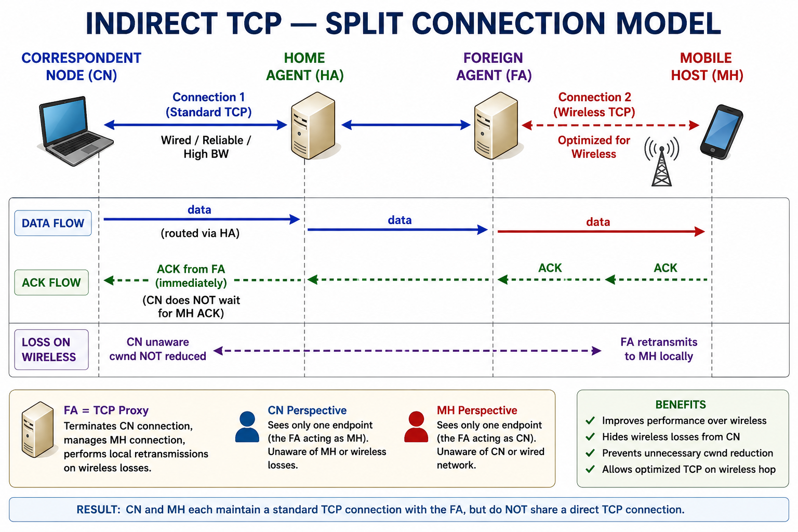
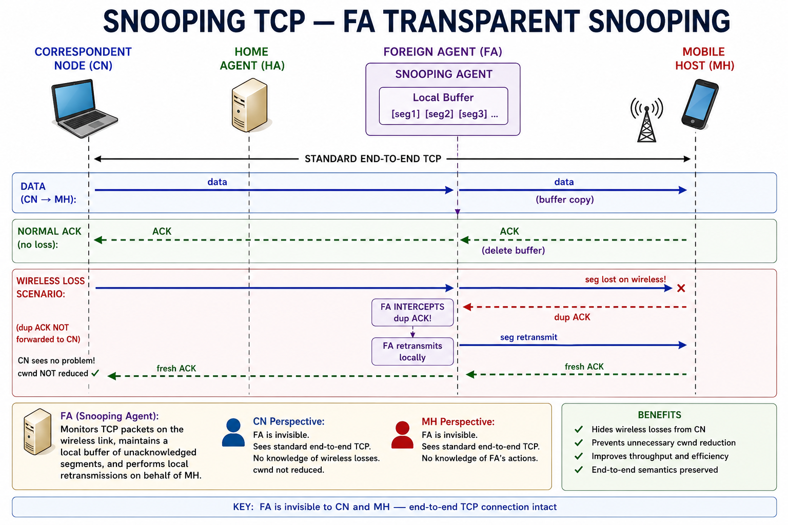
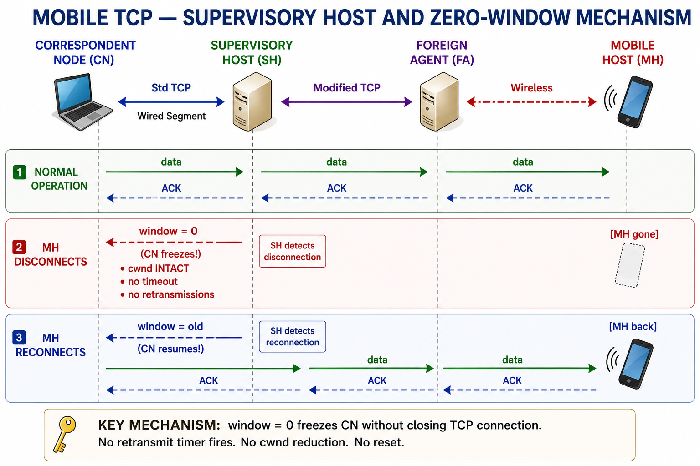
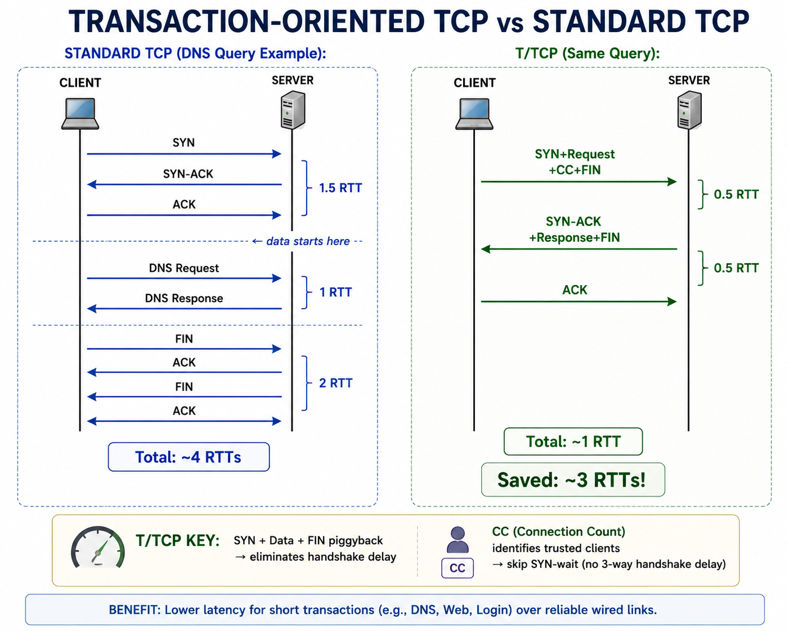
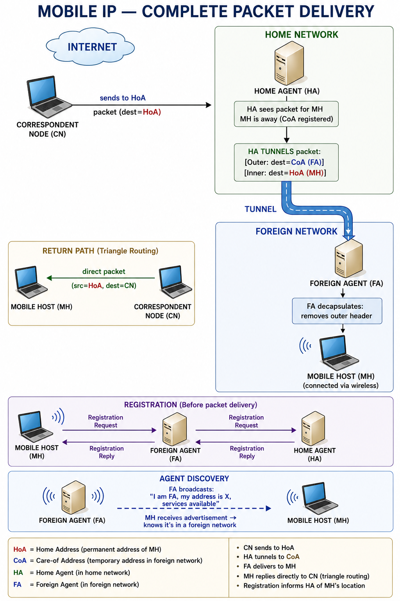
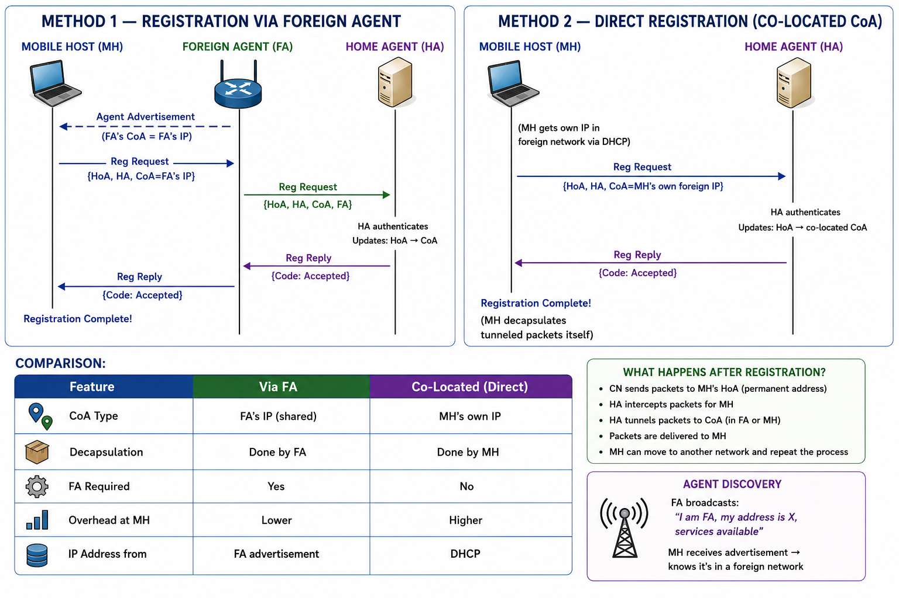
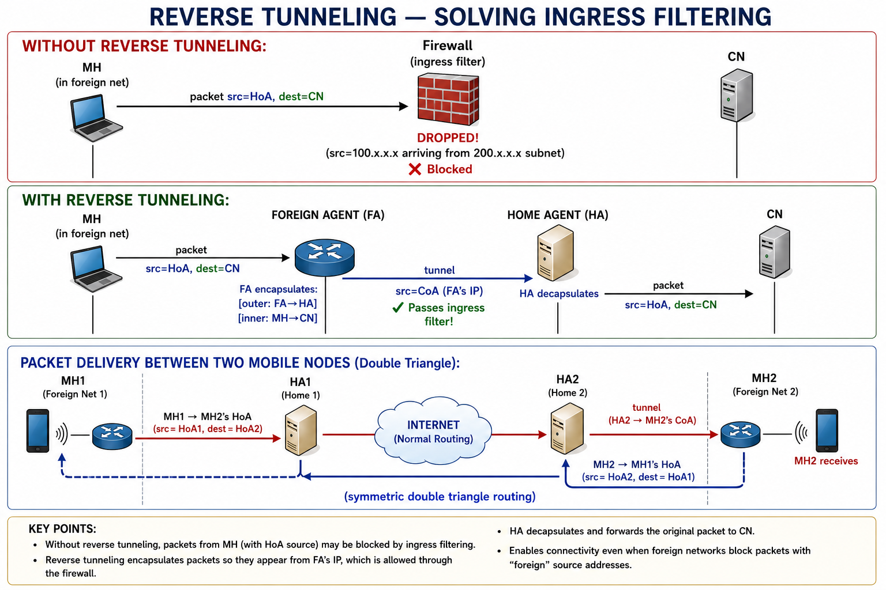
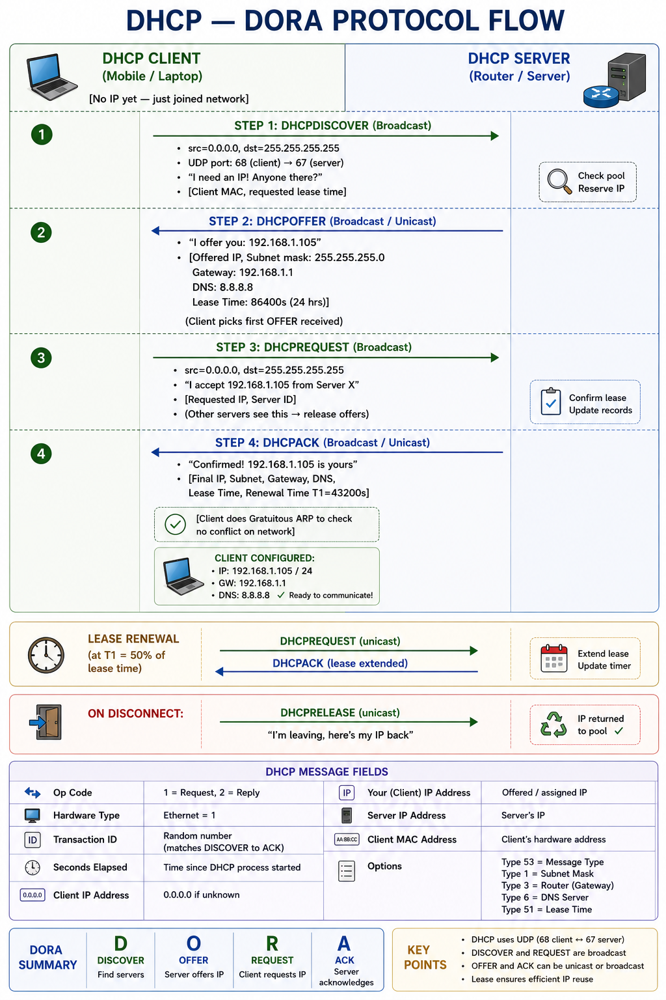
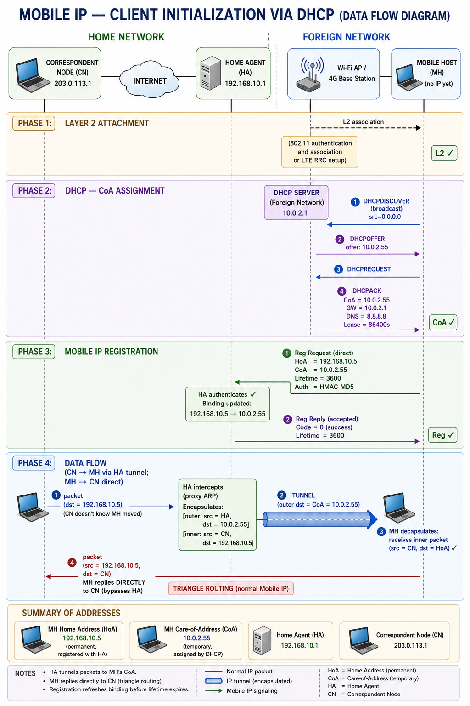

# UNIT : 4

---

# Important Questions Covered

1. Indirect TCP — Modifications / Principle of Operation, Advantages and Disadvantages
2. Snooping TCP — Explain with Diagram, Advantages and Disadvantages
3. Mobile TCP (M-TCP) — Short Note, Advantages and Disadvantages
4. Transaction-Oriented TCP (T/TCP) — Explain with Diagram, Advantages and Disadvantages
5. Need of Mobile IP and IP Packet Delivery (Agent Discovery, Registration, Tunneling)
6. Encapsulation in Mobile IP — Types (IP-in-IP, Minimal, GRE) and Explanation
7. Registration of Mobile Node via FA and Directly with HA — with Diagrams
8. IP Packet Delivery between Two Mobile Nodes and Reverse Tunneling

---

# Background: Why TCP Needs Modifications for Mobile Networks?

## The Core Problem

Standard **TCP (Transmission Control Protocol)** was designed for **wired networks** where:
- Packet loss = **network congestion** (the only assumed cause)
- When congestion detected → TCP reduces **Congestion Window (cwnd)**
- This behaviour is called **congestion control**

In **wireless/mobile networks**, packet loss can occur due to:
- **Handover (handoff):** Node moves from one access point to another
- **Wireless channel errors:** Bit errors, noise, fading, interference
- **Disconnection:** Node moves out of coverage temporarily

**Problem:** TCP **incorrectly treats** wireless losses as congestion → unnecessarily shrinks cwnd → **severely reduces throughput** even when the network is not congested.

**Solution:** Modify TCP to handle wireless losses differently from congestion losses. Three major approaches: **Indirect TCP, Snooping TCP, Mobile TCP**.

---

# Q1. Indirect TCP (I-TCP) — Modifications / Principle of Operation

## Introduction

**Indirect TCP (I-TCP)** is a **split-connection approach** to solving TCP performance problems in mobile wireless networks. Proposed by **Bakre and Badrinath (1995)**, I-TCP splits a single TCP connection between a **Correspondent Node (CN)** and a **Mobile Host (MH)** into **two separate TCP connections** at the **Foreign Agent (FA)**.

It is the **#1 most asked question** in this subject — appeared in all 6 exam papers.

---

## Main Answer

### Core Principle: Split Connection

The standard TCP connection (CN ↔ MH) is **divided at the Foreign Agent (FA)** into:

1. **Connection 1 (Wired Segment):** CN ↔ FA — Standard TCP over wired/reliable network
2. **Connection 2 (Wireless Segment):** FA ↔ MH — Optimized TCP (or another protocol) over wireless link

The FA acts as a **TCP proxy** — it terminates the CN's TCP connection and independently manages the wireless TCP connection to MH.

### How I-TCP Works (Step-by-Step)

#### Step 1 — Connection Setup

- CN wants to communicate with MH.
- CN opens a **standard TCP connection to FA** (believing FA to be the endpoint — FA acts as MH proxy).
- FA simultaneously opens a **second TCP connection to MH** (wireless segment).
- Two independent 3-way handshakes are performed.

#### Step 2 — Data Transfer

- CN sends data → **FA receives and buffers it** (via Connection 1).
- FA **acknowledges to CN** immediately (without waiting for MH ACK).
- FA **retransmits data to MH** via Connection 2 (wireless-optimized TCP).
- MH **acknowledges to FA** (not to CN).

#### Step 3 — Handling Wireless Losses

- If a **wireless error** occurs on FA → MH segment:
  - FA handles **local retransmission** on Connection 2.
  - CN is **completely unaware** of the wireless loss.
  - CN's TCP congestion window is **NOT reduced**.
- Only FA → MH segment uses wireless-optimized parameters (smaller timeouts, etc.)

#### Step 4 — Handover (Handoff)

- When MH moves to a new cell (new FA):
  - Old FA must **transfer buffered data and connection state** to new FA.
  - This involves **context transfer** protocol between FAs.
  - MH then continues with new FA on Connection 2.
  - CN's Connection 1 remains **completely unchanged**.

---

## Diagram

```
INDIRECT TCP — SPLIT CONNECTION MODEL

  CORRESPONDENT                HOME           FOREIGN           MOBILE
    NODE (CN)                AGENT (HA)      AGENT (FA)         HOST (MH)
       |                        |                |                 |
       |                        |                |                 |
       |<====== Connection 1 (Standard TCP) =====>|                |
       |       Wired / Reliable / High BW         |                |
       |                                          |                |
       |                                          |<=== Conn 2 ===>|
       |                                          | Wireless TCP   |
       |                                          | Optimized      |
       |                                          |                |
       |                                          |                |
  DATA FLOW:                                      |                |
       |----data---->                             |                |
       |             (routed via HA)              |                |
       |                              ----data--->|                |
       |                                          |---data-------->|
       |                                          |                |
  ACK FLOW:                                       |                |
       |<----ACK from FA (immediately)------------|                |
       |  (CN does NOT wait for MH ACK)           |<---ACK---------|
       |                                          |                |
  LOSS ON WIRELESS:                               |                |
       |  CN unaware ←─────────────────────  FA retransmits to MH |
       |  cwnd NOT reduced                        | locally        |
       |                                          |                |

  ┌────────────────────────────────────────────────────────────────┐
  │ FA = TCP Proxy: Terminates CN connection, manages MH connection │
  │ CN sees: one endpoint (FA acting as MH)                        │
  │ MH sees: one endpoint (FA acting as CN)                        │
  └────────────────────────────────────────────────────────────────┘
```

*Figure: Indirect TCP — Split Connection at Foreign Agent*

---

### Modifications to Standard TCP in I-TCP

| Modification | Description |
|---|---|
| **Split Connection** | Single TCP connection split into two at FA |
| **Local ACK at FA** | FA acknowledges CN before MH receives data |
| **Independent Congestion Control** | Each segment has its own cwnd, retransmission timer |
| **Wireless-Optimized Parameters** | Connection 2 uses smaller timeouts, adjusted thresholds |
| **Context Transfer on Handover** | FA transfers connection state during handoff |
| **FA as TCP Proxy** | FA terminates CN's connection on behalf of MH |

---

### Advantages of Indirect TCP

1. **Isolates Wireless Segment** — Wireless errors affect only Connection 2; CN's TCP is completely shielded from wireless problems.
2. **No Congestion Window Reduction at CN** — TCP throughput from CN side is not degraded by wireless losses.
3. **Optimized Wireless Parameters** — Connection 2 can use wireless-specific retransmission strategies, smaller RTTs, and adjusted thresholds.
4. **Handover Transparency to CN** — CN is completely unaware of MH movement; Connection 1 is never interrupted.
5. **Independent Protocol for Wireless** — Connection 2 can even use a non-TCP protocol (e.g., UDP + custom reliability) for the wireless segment.
6. **Local Retransmission** — FA handles wireless retransmissions locally; reduces end-to-end retransmissions.

### Disadvantages of Indirect TCP

1. **Loss of TCP End-to-End Semantics** — TCP guarantees are split; CN's ACK does NOT mean MH has received data. Data can be lost in FA buffer if FA crashes.
2. **FA is a Single Point of Failure** — If FA fails, both connections break and all buffered data is lost.
3. **High Overhead at FA** — FA must maintain state for all MH connections; computational and memory burden is heavy.
4. **Handover Complexity** — Transferring connection state between old FA and new FA during handover is complex and introduces delay.
5. **Security Concerns** — FA intercepts encrypted TCP connections; acts as man-in-the-middle, breaking end-to-end security (TLS/SSL).
6. **Header Overhead** — Each segment has its own TCP headers, increasing overall overhead.
7. **Latency at FA** — FA buffering and ACK processing add latency for every data unit.

---

## Example

**Video call (CN) to a doctor's smartphone (MH) in a hospital:**
- CN (video server) → FA (hospital Wi-Fi gateway): standard TCP delivers video frames reliably.
- FA → Doctor's MH: wireless-optimized TCP handles retransmissions as doctor moves between wards.
- If doctor walks through a dead zone, FA retransmits locally — video server never pauses.

---

## Conclusion

**Indirect TCP** is highly effective at protecting CN-side throughput from wireless impairments. Its **split-connection architecture** isolates the unreliable wireless segment from the reliable wired segment. However, the **loss of end-to-end TCP semantics and handover complexity** are significant drawbacks. It remains a foundational approach to TCP optimization in mobile networks.

---

# Q2. Snooping TCP — Explain with Diagram, Advantages and Disadvantages

## Introduction

**Snooping TCP** is a wireless TCP optimization proposed by **Balakrishnan, Seshan, and Katz (1995)**. Unlike Indirect TCP which splits the connection, Snooping TCP **maintains the original end-to-end TCP connection** between CN and MH but introduces a **Snooping Agent at the Foreign Agent (FA)** that monitors (snoops) all packets passing through.

**Key principle:** The snooping agent is **transparent** to both CN and MH — they are unaware of its existence.

---

## Main Answer

### Core Principle: Transparent Snooping at FA

- The **FA snoops (monitors)** all TCP segments passing between CN and MH.
- FA **buffers data** sent from CN to MH.
- If a wireless loss is detected, FA **locally retransmits** the lost segment to MH **without informing the CN**.
- CN's **retransmission timer and congestion window are NOT triggered** by wireless losses.
- The end-to-end TCP connection **remains unbroken** — unlike I-TCP.

### Components of Snooping TCP

| Component | Role |
|---|---|
| **Snooping Agent** | Monitors all packets at FA; sits between wired and wireless segments |
| **Local Buffer** | FA buffers copies of segments sent to MH (for local retransmission) |
| **ACK Snooping** | FA intercepts MH ACKs — if ACK arrives, buffered copy is deleted |
| **NACK / Duplicate ACK Detection** | FA detects wireless loss and triggers local retransmission |

### How Snooping TCP Works (Step-by-Step)

#### Data Flow (CN → MH Direction)

1. **CN sends data segments** to MH (addressed to MH directly — standard TCP).
2. Segments pass through FA (the wireless access point).
3. **FA's snooping agent intercepts and buffers** a copy of each segment.
4. FA forwards the segment to MH over the wireless link.
5. MH receives segment → **sends ACK to CN**.
6. ACK passes through FA → FA **deletes the buffered copy** (confirmed received).
7. CN receives ACK → TCP operates normally.

#### Wireless Loss Detection and Local Retransmission

1. MH fails to receive a segment (wireless error).
2. MH sends a **duplicate ACK** (standard TCP behavior for loss detection).
3. Duplicate ACK passes through FA.
4. FA's snooping agent **intercepts the duplicate ACK** and recognizes it as a wireless loss.
5. FA **locally retransmits** the lost segment from its buffer to MH — **without forwarding the duplicate ACK to CN**.
6. CN **never sees the duplicate ACK** → CN's cwnd is NOT reduced.
7. MH receives the retransmitted segment → sends a fresh ACK → CN receives it normally.

#### Handling CN-Side Congestion

- FA differentiates: if **3 duplicate ACKs** reach CN (FA lets them pass), it's genuine congestion.
- FA **passes duplicate ACKs** to CN only when loss is on the wired segment (congestion).
- FA **suppresses duplicate ACKs** when loss is on the wireless segment (handled locally).

#### MH → CN Direction (Reverse Path)

- Snooping agent can also buffer **MH-to-CN segments**.
- If MH temporarily disconnects (handover), FA can retransmit from buffer.
- CN is kept alive; no timeout occurs.

---

## Diagram

```
SNOOPING TCP — FA TRANSPARENT SNOOPING

  CORRESPONDENT          HOME             FOREIGN AGENT (FA)          MOBILE
    NODE (CN)           AGENT (HA)    +─────────────────────+         HOST (MH)
       |                   |          |  SNOOPING AGENT     |            |
       |                   |          |  ┌───────────────┐  |            |
       |                   |          |  │ Local Buffer  │  |            |
       |                   |          |  │ [seg1][seg2]  │  |            |
       |                   |          |  └───────────────┘  |            |
       |                   |          +─────────────────────+            |
       |                   |                    |                        |
  ─────────── STANDARD END-TO-END TCP ──────────────────────────────────
       |                                        |                        |
  DATA (CN → MH):                               |                        |
       |───data──────────────────────────────>  |──data──────────────>   |
       |                                        | (buffer copy)          |
       |                                        |                        |
  NORMAL ACK (no loss):                         |                        |
       |<──ACK────────────────────────────────  |<──ACK──────────────    |
       |                                        | (delete buffer)        |
       |                                        |                        |
  WIRELESS LOSS SCENARIO:                       |                        |
       |                                     seg lost on wireless!       |
       |                                        |                    [X] |
       |                                        |<──dup ACK──────────    |
       |  FA INTERCEPTS dup ACK!                |                        |
       |  FA retransmits locally ──────────────>|──seg retransmit─────>  |
       |  (dup ACK NOT forwarded to CN)         |                        |
       |<──fresh ACK (MH got it)─────────────── |<──fresh ACK─────────   |
       |  CN sees no problem!                   |                        |
       |  cwnd NOT reduced ✓                    |                        |
       |                                        |                        |

  KEY: FA is invisible to CN and MH — end-to-end TCP connection intact
```

*Figure: Snooping TCP — FA Snooping Agent Intercepts Wireless Losses Transparently*

---

### Advantages of Snooping TCP

1. **End-to-End TCP Semantics Preserved** — Unlike I-TCP, the original TCP connection between CN and MH is maintained. ACK to CN means MH has received the data.
2. **Transparent to CN and MH** — Neither endpoint knows about the snooping agent; no software changes at CN or MH required.
3. **No Congestion Window Reduction for Wireless Losses** — FA suppresses duplicate ACKs for wireless losses; CN's throughput is protected.
4. **Local Retransmission** — Wireless retransmissions handled at FA; reduces end-to-end latency.
5. **Bidirectional Support** — FA can snoop both directions (CN→MH and MH→CN).
6. **Handover Support** — Buffer at FA protects data during brief disconnections (MH moving between cells).
7. **No Context Transfer Problem** — Since the TCP connection is end-to-end, handover doesn't require complex state migration between FAs (unlike I-TCP).

### Disadvantages of Snooping TCP

1. **Fails with Encryption** — If TCP payload is encrypted (TLS/SSL), FA cannot read the ACK numbers to identify duplicate ACKs or segment losses.
2. **FA Overhead** — FA must maintain per-connection buffers and inspect every packet — heavy processing load.
3. **Snooping Buffer Loss on FA Failure** — If FA crashes, buffered segments are lost; MH may experience loss.
4. **Handover Complexity** — When MH moves to a new FA, the buffer state at the old FA must still be handled.
5. **Duplicate ACK Ambiguity** — Distinguishing wireless loss from congestion-induced duplicate ACKs is non-trivial.
6. **Not Fully Transparent on Handover** — During handoff, if old FA's buffer cannot be transferred, CN may see timeouts.
7. **Does Not Handle Long Disconnections** — FA buffer is finite; prolonged MH disconnection exhausts buffer and CN eventually times out.

---

## Comparison: I-TCP vs Snooping TCP

| Feature | Indirect TCP (I-TCP) | Snooping TCP |
|---|---|---|
| **Connection Type** | Split into 2 connections at FA | Single end-to-end connection |
| **End-to-End Semantics** | ❌ Lost (FA ACKs CN early) | ✅ Preserved |
| **Transparency** | Not transparent (FA is endpoint) | Transparent to CN and MH |
| **Encryption Compatibility** | ✅ Works (each connection separate) | ❌ Fails with encrypted TCP |
| **Handover Complexity** | High (state transfer between FAs) | Moderate |
| **CN Software Changes** | None | None |
| **MH Software Changes** | None | None |

---

## Example

**Student (MH) streaming a lecture (CN) on a university campus Wi-Fi:**
- CN streams video as standard TCP.
- As student moves between classrooms (different Wi-Fi APs), FA snoops ACKs.
- If a wireless segment drops, FA retransmits locally — stream continues without stutter.
- CN never slows down its send rate. Seamless experience maintained.

---

## Conclusion

**Snooping TCP** is widely regarded as a more elegant solution than I-TCP because it **preserves end-to-end TCP semantics** while achieving similar performance benefits. Its **transparency** means it can be deployed at wireless access points without any changes to end systems. The main limitation is its **inability to work with encrypted connections**.

---

# Q3. Mobile TCP (M-TCP) — Short Note, Advantages and Disadvantages

## Introduction

**Mobile TCP (M-TCP)** is a modification of TCP for mobile environments proposed by **Brown and Singh (1997)**. M-TCP introduces a **Supervisory Host (SH)** that intercepts TCP connections and handles disconnections gracefully by using a **zero-window advertisement** mechanism. The key innovation is handling **long disconnections** without resetting the TCP connection.

---

## Main Answer

### Core Principle of M-TCP

Standard TCP handles disconnections by **retransmitting until timeout**, after which it **resets the connection**. M-TCP avoids this by:
- Detecting MH disconnection early.
- Sending a **zero window size (window = 0)** advertisement to the CN.
- This causes CN to **freeze** (stop sending) without closing the connection.
- When MH reconnects, window is restored and transmission resumes **without TCP reset**.

### Architecture: Supervisory Host (SH)

| Component | Role |
|---|---|
| **Supervisory Host (SH)** | Monitors MH connectivity; placed in the wired network |
| **Unmodified TCP** | Used on CN ↔ SH segment (wired — standard TCP) |
| **Modified TCP** | Used on SH ↔ MH segment (wireless — M-TCP modifications) |

### How M-TCP Works

#### Normal Operation

1. CN ↔ SH: Standard TCP connection over wired network.
2. SH ↔ MH: Modified TCP over wireless link.
3. SH **monitors MH connectivity** (via beacon or link-layer signals).
4. Data flows normally: CN → SH → MH, ACKs: MH → SH → CN.

#### Disconnection Handling

1. SH **detects MH disconnection** (handover, out of range, sleep mode).
2. SH immediately sends CN a TCP segment with **window size = 0**.
3. CN enters **persist mode** — waits for window to open, does NOT timeout, does NOT reduce cwnd.
4. No retransmissions. No congestion window reduction. Connection is **frozen at CN**.
5. SH **buffers data** sent by CN (minimal; CN is frozen).

#### Reconnection

1. MH reconnects to network (new FA or same FA).
2. SH sends CN a TCP segment with **original window size restored**.
3. CN **immediately resumes** sending from where it paused.
4. Transmission continues — **no reconnection handshake**, no lost data, no reset.

---

## Diagram

```
MOBILE TCP — SUPERVISORY HOST AND ZERO-WINDOW MECHANISM

  CORRESPONDENT       SUPERVISORY         FOREIGN           MOBILE
    NODE (CN)          HOST (SH)          AGENT (FA)        HOST (MH)
       |                   |                  |                 |
       |<== Std TCP =======|                  |                 |
       |   Wired Segment   |<==Modified TCP==>|<==Wireless====>|
       |                   |                  |                 |
  NORMAL OPERATION:                           |                 |
       |---data----------->|----data--------->|----data-------->|
       |<--ACK-------------|<--ACK------------|<--ACK-----------|
       |                   |                  |                 |
  MH DISCONNECTS:          |                  |           [MH gone]
       |                   | SH detects       |                 |
       |<--window=0--------|  disconnection   |                 |
       |  (CN freezes!)    |                  |                 |
       |  (cwnd INTACT)    |                  |                 |
       |  (no timeout)     |                  |                 |
       |                   |                  |                 |
  MH RECONNECTS:           |                  |           [MH back]
       |                   | SH detects       |                 |
       |<--window=old------|  reconnection    |                 |
       |  (CN resumes!)    |                  |                 |
       |---data----------->|----data--------->|----data-------->|
       |                   |                  |                 |

  ┌─────────────────────────────────────────────────────────────┐
  │ KEY MECHANISM: window=0 freezes CN without closing TCP      │
  │ No retransmit timer fires. No cwnd reduction. No reset.    │
  └─────────────────────────────────────────────────────────────┘
```

*Figure: Mobile TCP — SH uses Zero Window to Freeze CN during MH Disconnection*

---

### Advantages of M-TCP

1. **Handles Long Disconnections Gracefully** — CN is frozen (not reset) during disconnection; connection survives extended breaks unlike standard TCP.
2. **No cwnd Reduction During Disconnection** — CN's congestion window is completely preserved; full throughput resumes immediately after reconnection.
3. **No False Congestion Signals** — Wireless losses and disconnections are not interpreted as congestion.
4. **Transparent to MH** — MH does not require significant modification; SH handles the complexity.
5. **Preserves End-to-End Semantics** — ACK to CN means MH has received data (unlike I-TCP).
6. **Efficient for Sleep Mode / Power Saving** — Ideal for mobile devices that periodically enter sleep/power-save modes.
7. **Simple CN-Side Behavior** — CN simply waits (persist mode) — no special CN-side software needed.

### Disadvantages of M-TCP

1. **SH is Single Point of Failure** — If SH fails, all MH connections it manages break.
2. **SH Bottleneck** — All data passes through SH; heavy traffic creates bottleneck and latency.
3. **Handover Complexity** — When MH moves, SH must coordinate with new FA; state transfer required.
4. **Split Connection Issue** — Like I-TCP, M-TCP splits the connection at SH; end-to-end TCP semantics are partially broken (SH ACKs CN before MH receives).
5. **Buffer Requirements at SH** — SH must buffer data during MH disconnection; large buffers needed for extended disconnections.
6. **SH Placement Problem** — SH must be correctly placed in the wired backbone; placement affects performance and scalability.

---

## Comparison: I-TCP vs Snooping TCP vs M-TCP

| Feature | I-TCP | Snooping TCP | M-TCP |
|---|---|---|---|
| **Approach** | Split connection at FA | Snooping at FA | Supervisory Host |
| **End-to-End Semantics** | ❌ Lost | ✅ Preserved | Partially lost |
| **Long Disconnection** | Moderate support | Poor support | ✅ Excellent |
| **Handover Support** | Complex state transfer | Moderate | Moderate |
| **Encryption Compatibility** | ✅ Works | ❌ Fails | ✅ Works |
| **CN cwnd on Disconnection** | Not reduced | Not reduced | ✅ Frozen (not reduced) |
| **CN changes needed** | None | None | None |
| **MH changes needed** | None | None | Minor |
| **Key Mechanism** | FA as TCP proxy | FA snoops ACKs | SH sends window=0 |

---

## Conclusion

**M-TCP** is uniquely suited for scenarios involving **long and frequent disconnections** (e.g., tunnels, sleep mode, handover delays). Its **zero-window mechanism** elegantly freezes the CN without resetting the TCP connection, preserving the full congestion window for instant resumption. Its main drawbacks are SH complexity and the partial loss of end-to-end semantics.

---

# Q4. Transaction-Oriented TCP (T/TCP) — Explain with Diagram, Advantages and Disadvantages

## Introduction

**Transaction-Oriented TCP (T/TCP)** was proposed by **Bob Braden (RFC 1379, RFC 1644)** as an extension of TCP to optimize **short-lived, single request-response transactions**. The fundamental problem it addresses: standard TCP's 3-way handshake + 4-way teardown is too expensive for short transactions (e.g., a single DNS query, a small HTTP request). T/TCP combines **connection setup, data transfer, and teardown** into a minimal exchange.

---

## Main Answer

### Problem with Standard TCP for Short Transactions

Standard TCP for a simple request-response involves:
1. **3-way handshake** (SYN → SYN-ACK → ACK) — 1.5 RTT delay before data
2. **Data Transfer** — actual payload exchange
3. **4-way teardown** (FIN → ACK → FIN → ACK) — 2 RTT to close

**Total overhead for a 1-packet request + 1-packet response = 3–4 RTTs of setup/teardown!**

For a DNS query (typically 1 UDP-like round trip needed), this is extremely wasteful.

### T/TCP Solution: TAO (TCP Accelerated Open)

**TAO (TCP Accelerated Open)** is the key mechanism in T/TCP:
- Assigns each connection a **Connection Count (CC)** number.
- If client has connected to this server before, skip the 3-way handshake.
- Client sends **SYN + Data** in the first segment (piggybacking).
- Server replies with **SYN-ACK + Data** (piggybacking response).
- Connection opens, data transfers, and connection closes — all in **1 RTT** (ideal case).

### T/TCP Modifications to Standard TCP

| Modification | Description |
|---|---|
| **CC Option** | Connection Count — unique number per connection for TAO |
| **CCnew Option** | Used for fresh connections where server has no CC cached |
| **CCecho Option** | Server echoes client's CC to confirm TAO validity |
| **SYN + Data** | Client piggybacks request data on SYN segment |
| **FIN Piggybacking** | FIN is sent with the last data segment |
| **Shortened TIME_WAIT** | TIME_WAIT state shortened using CC numbers |

### T/TCP Operation — Step-by-Step

#### Standard TCP (for comparison)

```
Client          Server
  |---SYN-------->|        (Step 1: handshake)
  |<--SYN-ACK-----|        (Step 2: handshake)
  |---ACK-------->|        (Step 3: handshake — 1.5 RTT delay)
  |---Request---->|        (Step 4: data)
  |<--Response----|        (Step 5: data)
  |---FIN-------->|        (Step 6: teardown)
  |<--ACK---------|
  |<--FIN---------|
  |---ACK-------->|        Total: 3-4 RTTs
```

#### T/TCP (TAO — first transaction)

```
Client              Server
  |---SYN+Data+FIN--->|    (SYN + request + FIN all in one!)
  |<--SYN-ACK+Data----|    (Response + SYN-ACK together)
  |---ACK------------>|    Total: ~1-1.5 RTT (vs 3-4 RTT)
```

#### T/TCP (TAO — repeated transaction, CC cached)

```
Client              Server
  |---SYN+Data+FIN+CC->|   (CC proves identity; no handshake wait)
  |<--Data+SYN-ACK+FIN-|   (Response immediately with FIN)
  Total: 1 RTT — handshake effectively skipped!
```

---

## Diagram

```
TRANSACTION-ORIENTED TCP vs STANDARD TCP

STANDARD TCP (DNS Query Example):              T/TCP (Same Query):
══════════════════════════════                 ══════════════════════════════
CLIENT          SERVER                         CLIENT          SERVER
  |                |                             |                |
  |──SYN──────────>|  ─┐                         |──SYN+Request──>|  ─┐
  |<──SYN-ACK──────|   │ 1.5 RTT                 |  +CC+FIN       |   │ 0.5 RTT
  |──ACK───────────>|  ─┘                         |                |  ─┘
  |                |   ← data starts here         |<──SYN-ACK──────|  ─┐
  |──DNS Request──>|  ─┐                         |  +Response+FIN |   │ 0.5 RTT
  |<──DNS Response─|   │ 1 RTT                   |──ACK───────────>|  ─┘
  |                |  ─┘                         |                |
  |──FIN───────────>|  ─┐                         Total: ~1 RTT
  |<──ACK──────────|   │
  |<──FIN──────────|   │ 2 RTT
  |──ACK───────────>|  ─┘

  Total: ~4 RTTs                               Saved: ~3 RTTs!

  ┌─────────────────────────────────────────────────────────────────────┐
  │ T/TCP KEY: SYN + Data + FIN piggyback → eliminates handshake delay │
  │ CC (Connection Count) identifies trusted clients → skip SYN-wait   │
  └─────────────────────────────────────────────────────────────────────┘
```

*Figure: Standard TCP vs T/TCP — Transaction Round-Trip Comparison*

---

### Advantages of T/TCP

1. **Dramatic Latency Reduction** — Eliminates 1.5 RTT handshake delay; ideal for request-response applications.
2. **Piggybacking** — SYN + Data + FIN in a single segment reduces total packets exchanged.
3. **Shortened TIME_WAIT** — CC numbers allow TIME_WAIT state to be shortened or eliminated, freeing ports faster.
4. **Backward Compatible** — T/TCP falls back to standard TCP if server doesn't support it.
5. **Better Performance for DNS, HTTP** — Real-world protocols that are request-response benefit enormously.
6. **Reduced Server Load** — Fewer connection states to maintain; faster connection teardown.
7. **Eliminates SYN Flooding Vulnerability** — CC mechanism provides implicit authentication for repeat clients.

### Disadvantages of T/TCP

1. **Security Vulnerability (Initial)** — TAO skip of handshake can be exploited if CC numbers are predictable; susceptible to replay attacks.
2. **CC State Maintenance** — Server must cache CC values for all clients; adds memory overhead.
3. **Limited to Short Transactions** — Not beneficial for long-lived connections (file transfers, streaming); adds complexity for no gain.
4. **Not Widely Deployed** — Despite RFC standardization, T/TCP has seen limited real-world adoption (QUIC has emerged as the modern alternative).
5. **CC Number Synchronization** — Maintaining synchronized CC numbers across server restarts or failover is complex.
6. **Incompatibility with NAT/Firewalls** — Many firewalls and NAT devices block non-standard TCP options; CC options may be stripped.

---

## Example

**DNS Resolution (standard UDP-like query):**
- Standard DNS uses UDP (1 RTT) because TCP's overhead was too high.
- With T/TCP, DNS over TCP becomes equally efficient:
  - Client: `SYN + "Query: www.example.com?" + FIN + CC`
  - Server: `SYN-ACK + "Response: 192.168.1.1" + FIN`
  - Total: 1 RTT — same as UDP, but with TCP's reliability.

---

## Conclusion

**T/TCP** is an elegant optimization for **short transaction workloads** by collapsing the TCP 3-way handshake into a single round trip. While it solves a real performance problem (later echoed by QUIC's 0-RTT handshake), **security concerns and limited adoption** have kept it from widespread deployment. Modern systems prefer **QUIC (HTTP/3)** which achieves similar goals with better security.

---

# Q5. Need of Mobile IP and IP Packet Delivery

## Introduction

**Mobile IP** is a standard protocol defined by **IETF (RFC 3344 for IPv4, RFC 6275 for IPv6)** that allows a mobile device to maintain a **permanent IP address** while moving across different networks. Without Mobile IP, when a device moves to a new network, it gets a new IP address — all existing connections break. Mobile IP solves this with a **permanent home address** and **tunneling**.

---

## Main Answer

### Need for Mobile IP

When a mobile device (MH) moves from one network to another:

**Problem 1 — IP Address Change:**
- IP routing is location-dependent (subnet-based).
- Moving to a new subnet means getting a new IP.
- All TCP connections using the old IP **break immediately**.

**Problem 2 — Routing Table Updates:**
- Updating routers worldwide for every mobile device's movement = impossible.
- The internet has billions of devices; global route updates would overwhelm routers.

**Problem 3 — Seamless Communication:**
- Applications need continuous connectivity; they cannot handle IP address changes.

**Mobile IP Solution:**
- MH keeps a **permanent Home Address (HoA)** — registered with Home Agent (HA).
- When MH moves, it registers a **Care-of-Address (CoA)** with Foreign Agent (FA).
- HA **tunnels** packets destined for HoA to the CoA.
- From the internet's view, MH is always reachable at HoA — **location transparent**.

### Key Components of Mobile IP

| Component | Description |
|---|---|
| **Mobile Host (MH)** | Device that moves between networks |
| **Home Agent (HA)** | Router in home network; maintains MH's location binding; tunnels packets |
| **Foreign Agent (FA)** | Router in visited network; provides CoA; decapsulates tunneled packets |
| **Correspondent Node (CN)** | Any internet host communicating with MH |
| **Home Address (HoA)** | MH's permanent IP address (registered with HA) |
| **Care-of Address (CoA)** | Temporary IP in visited network (FA's address or co-located) |
| **Binding** | Mapping of HoA → CoA registered with HA |

### Mobile IP Operations

#### Phase 1 — Agent Discovery

1. HA and FA **broadcast Agent Advertisement** messages (ICMP Router Advertisement extension).
2. MH listens for these advertisements to detect movement.
3. If MH hears a **different FA advertisement**, it knows it has moved to a new network.
4. MH can also send **Agent Solicitation** to actively request advertisements.

#### Phase 2 — Registration

1. MH obtains a CoA from the FA (FA's IP address, shared by all MHs on that FA).
2. MH sends a **Registration Request** to HA (via FA):
   - Contains: HoA, CoA, HA address, lifetime, nonce.
3. HA **authenticates** the request and updates its **binding table**: `HoA → CoA`
4. HA sends a **Registration Reply** (accepted/denied) back to MH via FA.

#### Phase 3 — Packet Delivery (CN → MH)

1. CN sends packet to MH's **permanent HoA** (CN doesn't know MH has moved).
2. Packet routes to MH's **home network** (normal IP routing).
3. **HA intercepts** the packet (it's on the home network, acting as proxy ARP for MH).
4. HA **encapsulates** (tunnels) the packet inside a new IP packet destined for **CoA** (FA's address).
5. Encapsulated packet travels across the internet to **FA**.
6. FA **decapsulates** (removes outer IP header) and delivers the original packet to **MH**.

#### Phase 4 — Packet Return (MH → CN)

1. MH sends reply packets **directly to CN** (not through HA).
2. Source address = MH's HoA (ensures CN sees consistent address).
3. This is called **Triangle Routing** (CN→HA→FA→MH but MH→CN directly).

---

## Diagram

```
MOBILE IP — COMPLETE PACKET DELIVERY

INTERNET
   |
   |─────────────────────────────────────────────┐
   |                                             |
CORRESPONDENT NODE (CN)               HOME NETWORK
   |   sends to HoA                        |
   |──────────packet (dest=HoA)───────────>|
                                      HOME AGENT (HA)
                                           |
                                    HA sees packet for MH
                                    MH is away (CoA registered)
                                           |
                                    HA TUNNELS packet:
                                    [Outer: dest=CoA (FA)]
                                    [Inner: dest=HoA (MH) ]
                                           |
                             ─── TUNNEL ──────────────────>
                                                      FOREIGN NETWORK
                                                           |
                                                      FOREIGN AGENT (FA)
                                                           |
                                                    FA decapsulates:
                                                    removes outer header
                                                           |
                                                    Delivers to MH
                                                           |
                                                      MOBILE HOST (MH)
                                                    (connected via wireless)

RETURN PATH (Triangle Routing):
   MH ──────────direct packet (src=HoA, dest=CN)──────────> CN


REGISTRATION (Before packet delivery):
   MH──Registration Request──>FA──Registration Request──>HA
   HA──Registration Reply──>FA──Registration Reply──>MH


AGENT DISCOVERY:
   FA broadcasts: "I am FA, my address is X, services available"
   MH receives advertisement → knows it's in a foreign network
```

*Figure: Mobile IP — Agent Discovery, Registration, Tunneling, and Packet Delivery*

---

### Triangle Routing Problem

- CN → HA → FA → MH: packets take a **detour** via home network even if CN and MH are nearby.
- Solution: **Route Optimization** — CN gets MH's CoA and sends directly to FA. (Defined in Mobile IPv6)

---

### Advantages of Mobile IP

1. **Location Transparency** — CN always uses MH's permanent HoA; unaware of MH's movement.
2. **Seamless Handover** — TCP connections survive movement; only brief interruption during registration.
3. **Internet Compatible** — Works with existing IPv4 infrastructure; no changes to CN or routers.
4. **Security** — Registration messages are authenticated with a shared secret (MD5 based).
5. **Flexible CoA** — MH can use FA-CoA (shared) or Co-Located CoA (own IP).

### Disadvantages of Mobile IP

1. **Triangle Routing Inefficiency** — All CN→MH packets travel via home network even when CN and MH are nearby.
2. **Single HA Bottleneck** — HA handles all incoming traffic for MH; failure breaks all connections.
3. **Registration Latency** — Registration process adds handover delay.
4. **Ingress Filtering Problem** — MH→CN packets with HoA source may be dropped by firewalls (solved by reverse tunneling).
5. **Scalability** — HA must maintain binding for all mobile nodes; scales poorly.

---

## Conclusion

**Mobile IP** is the fundamental protocol enabling **IP-layer mobility** — allowing devices to roam across networks while maintaining permanent identities. Its tunneling and registration architecture forms the basis of modern **4G/5G mobile data networks**, though improvements like **route optimization** and **Mobile IPv6** have addressed its initial limitations.

---

# Q6. Encapsulation in Mobile IP — Types and Explanation

## Introduction

**Encapsulation** in Mobile IP is the process by which **HA wraps the original packet inside a new IP packet** addressed to the FA's Care-of-Address. This is necessary because the original packet's destination is the MH's Home Address — which does not route to the foreign network. Encapsulation creates a **tunnel** from HA to FA.

---

## Main Answer

### Why Encapsulation is Needed

1. CN sends packet: `src=CN, dest=HoA`
2. This packet routes to HA (MH's home network).
3. HA needs to forward it to FA (in a different network at CoA).
4. **Problem:** The inner packet has `dest=HoA` — routers would route it back to home network.
5. **Solution:** Encapsulate inner packet inside a new outer packet: `src=HA, dest=CoA`
6. Outer packet routes to FA. FA decapsulates and delivers inner packet to MH.

### Three Types of Encapsulation

| Type | Standard | Overhead | Description |
|---|---|---|---|
| **IP-in-IP** | RFC 2003 | 20 bytes | Most common; full new IP header added |
| **Minimal Encapsulation** | RFC 2004 | 8–12 bytes | Partial header; reduces overhead |
| **GRE (Generic Routing Encapsulation)** | RFC 1701/2784 | 4+ bytes | Cisco standard; supports non-IP protocols |

---

### Type 1 — IP-in-IP Encapsulation (Most Important)

The entire original IP packet is placed as the **payload** of a new outer IP packet.

**Original Packet:**
```
┌─────────────────────────────────────────────┐
│ IP Header: src=CN, dest=HoA                 │
│ Payload: Data (TCP/UDP segment)             │
└─────────────────────────────────────────────┘
```

**After IP-in-IP Encapsulation at HA:**
```
┌───────────────────────────────────────────────────────────────┐
│ OUTER IP Header: src=HA, dest=CoA (FA)    [20 bytes added]   │
│ Protocol = 4 (IP-in-IP)                                      │
├───────────────────────────────────────────────────────────────┤
│ INNER IP Header: src=CN, dest=HoA         [original header]  │
│ Payload: Data (TCP/UDP segment)           [original payload]  │
└───────────────────────────────────────────────────────────────┘
```

- Outer header routes packet from HA to FA.
- FA decapsulates (removes outer header) → restores original packet → delivers to MH.
- **Overhead:** 20 bytes per packet (full outer IP header).

---

### Type 2 — Minimal Encapsulation

Reduces overhead by **not duplicating fields** that are the same in inner and outer headers.

- Uses a **Minimal Forwarding Header (MFH)** of only **8 bytes** (or 12 bytes with source field).
- **Fields moved from inner header to outer header:** TTL, Source Address (optional).
- Original IP header is **partially reconstructed** at FA.
- **Overhead:** 8–12 bytes (vs 20 bytes for IP-in-IP).
- Limitation: Cannot be used if the original packet is fragmented.

---

### Type 3 — GRE (Generic Routing Encapsulation)

- Cisco-developed standard (RFC 1701); widely supported in enterprise networks.
- Adds a **GRE header** between outer IP header and inner IP packet.
- Supports **non-IP protocols** (IPX, AppleTalk, etc.) inside the tunnel.
- Supports **multicast tunneling**.
- **GRE Header:** 4 bytes minimum; can include checksum, sequence numbers, key fields.
- More flexible than IP-in-IP; used in VPNs and SD-WAN.

---

## Diagram

```
THREE ENCAPSULATION TYPES — HEADER COMPARISON

ORIGINAL PACKET:          IP Header | Data
                          [src=CN, dest=HoA]

IP-in-IP (RFC 2003):
┌──────────────────┬──────────────────┬──────────┐
│ Outer IP Header  │ Inner IP Header  │   Data   │
│ src=HA, dest=CoA │ src=CN, dest=HoA │          │
│ [20 bytes]       │ [20 bytes]       │          │
└──────────────────┴──────────────────┴──────────┘

MINIMAL (RFC 2004):
┌──────────────────┬─────────────────┬──────────┐
│ Outer IP Header  │ Min.Fwd.Header  │   Data   │
│ src=HA, dest=CoA │ [8-12 bytes]    │          │
│ [modified]       │ (fewer fields)  │          │
└──────────────────┴─────────────────┴──────────┘

GRE (RFC 1701):
┌──────────────────┬────────────┬──────────────────┬──────────┐
│ Outer IP Header  │ GRE Header │ Inner IP Header  │   Data   │
│ src=HA, dest=CoA │ [4+ bytes] │ src=CN, dest=HoA │          │
└──────────────────┴────────────┴──────────────────┴──────────┘

OVERHEAD COMPARISON:
  IP-in-IP:  20 bytes (always)
  Minimal:   8-12 bytes
  GRE:       4+ bytes + flexibility
```

*Figure: Encapsulation Types in Mobile IP*

---

## Conclusion

**IP-in-IP encapsulation** is the default and most widely implemented method in Mobile IP. **Minimal encapsulation** reduces overhead for bandwidth-constrained links. **GRE** offers the most flexibility, including support for non-IP protocols and multicast. The choice depends on **network overhead tolerance, protocol support, and infrastructure compatibility**.

---

# Q7. Registration of Mobile Node via FA and Directly with HA

## Introduction

**Registration** in Mobile IP is the process by which a **Mobile Host (MH)** informs its **Home Agent (HA)** about its current location (CoA). Registration can happen in two ways: **via Foreign Agent (FA)** (the standard method) or **directly with HA** using a **co-located Care-of-Address** (when MH has its own IP in the foreign network).

---

## Main Answer

### Method 1 — Registration via Foreign Agent (FA)

This is the **standard registration method** when MH uses the FA's IP address as its CoA.

#### Step-by-Step Process

1. MH receives **Agent Advertisement** from FA (containing FA's IP = CoA).
2. MH creates a **Registration Request**:
   - Home Address (HoA), Home Agent address (HA), CoA (= FA's IP), Lifetime, Nonce (anti-replay), Authentication extension.
3. MH sends Registration Request **to FA**.
4. FA **validates** the request (checks Identification field).
5. FA appends its own information and **forwards to HA**.
6. HA **authenticates** the request (shared key between MH and HA).
7. HA **updates binding table**: `HoA → CoA (FA's IP)`
8. HA sends **Registration Reply** (code: accepted/denied) to FA.
9. FA **forwards Registration Reply** to MH.
10. Registration complete — HA now tunnels packets to FA for MH.

---

### Method 2 — Co-Located Registration (Direct with HA)

Used when MH obtains its **own IP address** in the foreign network (via DHCP or PPP).
- CoA = MH's own foreign IP (not FA's IP).
- MH acts as its own FA (decapsulates tunneled packets itself).
- MH sends Registration Request **directly to HA** (no FA involved).

#### Step-by-Step Process

1. MH obtains a **co-located CoA** (its own IP in foreign network via DHCP).
2. MH creates Registration Request with CoA = its own foreign IP.
3. MH sends Registration Request **directly to HA** (no FA intermediate).
4. HA authenticates and updates binding: `HoA → co-located CoA`
5. HA sends Registration Reply **directly to MH**.
6. HA tunnels packets to MH's co-located CoA; MH decapsulates them itself.

---

## Diagram

```
METHOD 1 — REGISTRATION VIA FOREIGN AGENT

   MOBILE HOST (MH)        FOREIGN AGENT (FA)       HOME AGENT (HA)
        |                         |                       |
        |<--Agent Advertisement---|                       |
        |   (FA's CoA = FA's IP)  |                       |
        |                         |                       |
        |--Reg Request----------->|                       |
        |  {HoA, HA, CoA=FA's IP} |                       |
        |                         |--Reg Request--------->|
        |                         |  {HoA, HA, CoA, FA}   |
        |                         |         HA authenticates
        |                         |         Updates: HoA→CoA
        |                         |<--Reg Reply-----------|
        |                         |  {Code: Accepted}     |
        |<--Reg Reply-------------|                       |
        | Registration Complete!  |                       |
        |                         |                       |


METHOD 2 — DIRECT REGISTRATION (CO-LOCATED CoA)

   MOBILE HOST (MH)                              HOME AGENT (HA)
        |                                               |
        | (MH gets own IP in foreign network via DHCP)  |
        |                                               |
        |--Reg Request----------------------------------->|
        |  {HoA, HA, CoA=MH's own foreign IP}           |
        |         HA authenticates                       |
        |         Updates: HoA → co-located CoA          |
        |<--Reg Reply-------------------------------------|
        |  {Code: Accepted}                              |
        | Registration Complete!                         |
        | (MH decapsulates tunneled packets itself)      |

COMPARISON:
┌──────────────────────┬────────────────────┬──────────────────────┐
│ Feature              │ Via FA             │ Co-Located (Direct)  │
├──────────────────────┼────────────────────┼──────────────────────┤
│ CoA Type             │ FA's IP (shared)   │ MH's own IP          │
│ Decapsulation        │ Done by FA         │ Done by MH           │
│ FA Required          │ Yes                │ No                   │
│ Overhead at MH       │ Lower              │ Higher               │
│ IP Address from      │ FA advertisement   │ DHCP                 │
└──────────────────────┴────────────────────┴──────────────────────┘
```

*Figure: Mobile IP Registration — Via FA and Direct (Co-Located)*

---

## Conclusion

**Registration via FA** is the standard approach — efficient and places decapsulation burden on FA. **Co-located registration** gives MH more independence but requires MH to handle decapsulation. Both methods achieve the same goal: **informing HA of MH's current location** so that packets can be correctly tunneled.

---

# Q8. IP Packet Delivery between Two Mobile Nodes and Reverse Tunneling

## Introduction

When **both communicating nodes are mobile** (CN is also a Mobile Host), standard Mobile IP triangle routing becomes **double-triangle routing** — extremely inefficient. Additionally, when MH's packets (with HoA source address) travel back toward CN via the home network, they may be **blocked by ingress filtering firewalls** — solved by **Reverse Tunneling**.

---

## Main Answer

### Packet Delivery Between Two Mobile Nodes

**Scenario:** MH1 (mobile) communicates with MH2 (also mobile).

#### Standard Mobile IP (Double Triangle):

1. MH1 (in Foreign Network 1) sends packet to MH2's HoA.
2. Packet routes to MH2's **Home Agent (HA2)**.
3. HA2 tunnels packet to MH2's CoA (Foreign Network 2). → FA2 delivers to MH2.
4. MH2 replies to MH1's HoA.
5. Packet routes to MH1's **Home Agent (HA1)**.
6. HA1 tunnels to MH1's CoA. → FA1 delivers to MH1.

**Problem:** Both directions go through respective home agents — **quadruple indirection** even if MH1 and MH2 are physically nearby.

#### Solution: Route Optimization

- MH2's HA2 sends MH2's CoA as a **Binding Update** to CN (MH1).
- MH1 then sends directly to MH2's CoA (skipping HA2).
- MH2 does the same for MH1.
- Packets flow **directly between FAs** after initial exchange.

---

### Reverse Tunneling — Why It's Needed

#### The Ingress Filtering Problem

**Ingress Filtering** (RFC 2827): Many ISPs and firewalls drop packets where the **source IP address does not belong** to the subnet the packet arrives from.

**Scenario Without Reverse Tunneling:**
- MH is in Foreign Network (subnet 200.x.x.x) but its HoA is in Home Network (100.x.x.x).
- MH sends packet: `src=100.x.x.x (HoA), dest=CN`
- Packet exits via FA (in 200.x.x.x subnet).
- **Router applies ingress filtering:** "Source 100.x.x.x arriving from 200.x.x.x subnet? DROP!"
- Packet is blocked. MH→CN communication fails.

**Solution: Reverse Tunneling**
- MH sends packet to **FA** (instead of directly to CN).
- FA **encapsulates** MH's packet: `src=FA's CoA, dest=HA`
- Packet routes from FA to HA via tunnel (source = FA's valid IP — passes ingress filter).
- HA **decapsulates** and sends original packet to CN: `src=HoA, dest=CN`
- CN receives packet normally.

---

## Diagram

```
REVERSE TUNNELING — SOLVING INGRESS FILTERING

WITHOUT REVERSE TUNNELING:
   MH (in foreign net)         Firewall (ingress filter)       CN
      |                               |                         |
      |──packet src=HoA, dest=CN───>  |                         |
      |                          DROPPED!                       |
      |     (src=100.x.x.x arriving from 200.x.x.x subnet)     |
      |                          ❌ Blocked                      |


WITH REVERSE TUNNELING:

   MH        FOREIGN AGENT (FA)        HOME AGENT (HA)          CN
    |               |                       |                    |
    |──packet──────>|                       |                    |
    | src=HoA       |  FA encapsulates:     |                    |
    |               |  [outer: FA→HA]       |                    |
    |               |  [inner: MH→CN]       |                    |
    |               |──tunnel──────────────>|                    |
    |               |  src=CoA (FA's IP)    |  HA decapsulates   |
    |               |  ✅ Passes ingress     |──packet──────────>|
    |               |     filter!           |  src=HoA, dest=CN  |
    |               |                       |                    |


PACKET DELIVERY BETWEEN TWO MOBILE NODES (Double Triangle):

  MH1 (Foreign Net 1)    HA1 (Home1)    HA2 (Home2)    MH2 (Foreign Net 2)
        |                    |               |                |
        |──MH1→MH2's HoA────>|    (normal routing)           |
        |                    |──────────────>|               |
        |                    |               |──tunnel───────>|
        |                    |               |               | MH2 receives
        |                    |               |               |
        |<──────────MH2→MH1's HoA (reverse path)────────────|
        | (symmetric double triangle routing)                |

```

*Figure: Reverse Tunneling (Ingress Filtering Solution) and Two-Mobile-Node Communication*

---

### Advantages of Reverse Tunneling

1. **Solves Ingress Filtering** — FA's CoA as source passes firewall checks everywhere.
2. **Enables Firewall Traversal** — Mobile nodes behind strict firewalls can communicate.
3. **Multicast Support** — Reverse tunnel allows MH to send multicast packets through HA (multicast routing is topology-sensitive).
4. **TTL Correctness** — HA can adjust TTL values; without reverse tunneling, TTL values from foreign network appear anomalous.

### Disadvantages of Reverse Tunneling

1. **Increased Latency** — All MH→CN packets travel via HA (similar overhead to forward triangle routing).
2. **HA Bottleneck** — HA handles both inbound (tunneled) and outbound (reverse tunneled) traffic.
3. **Double Triangle Routing** — Combined with forward tunneling, creates severe inefficiency for two nearby mobile nodes.
4. **Encapsulation Overhead** — Additional encapsulation headers on every packet.

---

## Conclusion

**Reverse tunneling** is a necessary extension to Mobile IP that addresses the practical problem of **ingress filtering in the modern internet**. While it adds overhead, it ensures MH→CN communication succeeds even when strict firewall policies are enforced. For two mobile nodes, **route optimization** (binding updates) is the long-term solution to eliminate double-triangle routing inefficiency.

---

# UNIT REVISION TABLE

| Topic | Key Points |
|---|---|
| **Indirect TCP (I-TCP)** | Split connection at FA · FA as TCP proxy · Local ACK · Wireless-optimized Connection 2 · No E2E semantics |
| **Snooping TCP** | FA snoops ACKs · Transparent to CN & MH · Local retransmission · E2E semantics preserved · Fails with encryption |
| **Mobile TCP (M-TCP)** | SH = Supervisory Host · window=0 freezes CN · Long disconnection support · cwnd preserved · Zero-window mechanism |
| **T/TCP** | TAO = TCP Accelerated Open · CC number · SYN+Data+FIN piggybacked · 1 RTT vs 4 RTT · Short transactions |
| **Mobile IP Need** | IP routing = location-based · MH keeps HoA · CoA in foreign network · HA tunnels packets |
| **Mobile IP Components** | HA · FA · MH · CN · HoA · CoA · Binding |
| **Mobile IP Packet Delivery** | Agent Discovery → Registration → HA tunnels → FA decapsulates → MH receives |
| **Encapsulation Types** | IP-in-IP (RFC 2003, 20B) · Minimal (RFC 2004, 8-12B) · GRE (RFC 1701, 4B+) |
| **Registration** | Via FA (CoA = FA's IP) · Co-located (CoA = MH's own IP, direct to HA) |
| **Reverse Tunneling** | Solves ingress filtering · MH→FA→HA→CN · FA's CoA as source passes firewall |
| **Two Mobile Nodes** | Double triangle routing · Route optimization = binding updates · Direct FA-to-FA after first exchange |

---

# One-Day Exam Revision Notes

### TCP Modifications — 3-Line Summaries

**I-TCP:** Split at FA. Two TCP connections. FA is proxy. CN isolated from wireless. No E2E semantics. Best for: isolating CN from wireless.

**Snooping TCP:** FA snoops ACKs. One E2E connection. Transparent. Local retransmit. Fails with TLS. Best for: preserving E2E semantics.

**M-TCP:** SH sends window=0. CN freezes (not reset). cwnd intact. Reconnect resumes instantly. Best for: long disconnections.

**T/TCP:** CC number skips handshake. SYN+Data+FIN piggybacked. 1 RTT. TAO. Best for: short request-response (DNS, HTTP).

### Mobile IP — Memory Sequence
**DART** → **D**iscovery → **A**gent Advertisement → **R**egistration → **T**unneling

### Key Equation
**Standard TCP short transaction: ~4 RTT**
**T/TCP with TAO: ~1 RTT**
**Savings: 3 RTTs per transaction**

### Window = 0 Trick (M-TCP)
SH detects disconnection → tells CN "window = 0" → CN enters persist mode (frozen, not dead) → MH reconnects → SH tells CN "window = normal" → transmission resumes.

### Encapsulation — Overhead Memory
**IP-in-IP = 20 bytes** (full outer header)
**Minimal = 8-12 bytes** (partial header)
**GRE = 4+ bytes** (flexible, non-IP support)

### Reverse Tunneling — 1-Line
**Problem:** src=HoA blocked by ingress filter. **Solution:** FA encapsulates MH packet → HA decapsulates → forwards to CN. Source at router = FA's CoA = valid.

---

# Frequently Repeated SPPU Questions

| Question | Frequency | Marks |
|---|---|---|
| Indirect TCP with diagram | ★★★★★ Highest (All 6 papers) | 8–9 marks |
| Snooping TCP with diagram | ★★★★★ Very High (5 papers) | 8–9 marks |
| Mobile TCP (M-TCP) | ★★★★ High (4 papers) | 8 marks |
| T/TCP with diagram | ★★★★ High (3 papers: ND25, ND24, MJ23) | 8–9 marks |
| Need of Mobile IP + Packet Delivery | ★★★★★ Very High (5 papers) | 8–9 marks |
| Encapsulation in Mobile IP | ★★★★ High (3 papers: ND23, MJ25, MJ23) | 8 marks |
| Registration via FA and Co-located | ★★★ Medium (2 papers: ND23, MJ24) | 8 marks |
| Reverse Tunneling | ★★★ Medium (1 paper: MJ23) | 8 marks |

---

# Last Minute Keywords

**Indirect TCP:** Split connection · FA as TCP proxy · Two TCP connections · Local ACK · Wired segment · Wireless segment · Bakre & Badrinath 1995 · Context transfer · No E2E semantics

**Snooping TCP:** Snooping agent · FA transparent · Local buffer · Duplicate ACK suppression · Local retransmission · E2E semantics preserved · Fails with TLS/SSL · Balakrishnan 1995

**Mobile TCP:** SH = Supervisory Host · window = 0 · Persist mode · cwnd frozen · Long disconnection · Brown & Singh 1997 · Zero-window advertisement

**T/TCP:** TAO = TCP Accelerated Open · CC = Connection Count · CCnew · CCecho · SYN + Data + FIN piggybacked · 1 RTT · Short transaction · RFC 1379 · RFC 1644 · Braden

**Mobile IP:** HoA = Home Address · CoA = Care-of-Address · HA = Home Agent · FA = Foreign Agent · Binding · Triangle routing · RFC 3344 (IPv4) · RFC 6275 (IPv6)

**Encapsulation:** IP-in-IP RFC 2003 · Minimal RFC 2004 · GRE RFC 1701 · Outer header · Decapsulate · Tunnel · 20 bytes / 8-12 bytes / 4+ bytes

**Registration:** Registration Request · Registration Reply · Lifetime · Nonce · Authentication · Binding table · Co-located CoA · Via FA

**Reverse Tunneling:** Ingress filtering · RFC 2827 · MH→FA→HA→CN · Firewall bypass · Multicast support · TTL correction

---

---

# Q9. DHCP — Basic Purpose, Protocol Explanation with Diagram

## Introduction

**DHCP (Dynamic Host Configuration Protocol)** is a **network management protocol** defined in **RFC 2131** that automatically assigns **IP addresses and network configuration parameters** to devices joining a network. Without DHCP, a network administrator would have to manually configure the IP address, subnet mask, default gateway, and DNS server on every device — an impractical task in large or dynamic networks (especially Wi-Fi hotspots and mobile networks where devices join and leave constantly).

DHCP follows a **client-server model**: the **DHCP Server** manages a pool of IP addresses and leases them to **DHCP Clients** (mobile devices, laptops, phones) for a configurable period called the **lease time**.

---

## Main Answer

### Basic Purpose of DHCP

1. **Automatic IP Address Assignment** — Dynamically assigns a unique IP address from a pool to each device that connects to the network; no manual configuration needed.
2. **Network Parameter Distribution** — Along with IP address, DHCP provides: subnet mask, default gateway, DNS server, NTP server, domain name — everything the device needs to communicate on the network.
3. **Address Reuse (Lease Management)** — IP addresses are leased for a limited time; when a device disconnects, its IP is returned to the pool and can be reassigned to another device.
4. **Conflict Prevention** — DHCP server maintains a central record of all assigned addresses, preventing two devices from getting the same IP (IP conflict).
5. **Scalability** — Supports networks ranging from a home router with 10 devices to a mobile carrier serving millions of devices.
6. **Mobile Support** — Critical for mobile networks where devices roam between cells and subnets; each new subnet assigns a fresh IP automatically via DHCP.

---

### DHCP Key Terminology

| Term | Description |
|---|---|
| **DHCP Server** | Server that manages IP address pool and responds to client requests |
| **DHCP Client** | Device requesting IP configuration (mobile phone, laptop) |
| **IP Address Pool (Scope)** | Range of IP addresses the server can assign (e.g., 192.168.1.100–192.168.1.200) |
| **Lease** | Temporary assignment of an IP address to a client for a defined duration |
| **Lease Time** | Duration of the IP assignment (e.g., 24 hours, 8 days) |
| **Renewal** | Client requests to extend its lease before it expires (at 50% of lease time) |
| **Rebinding** | Client broadcasts renewal request if unicast renewal fails (at 87.5% of lease time) |
| **DHCPDISCOVER** | Broadcast message from client to find available DHCP servers |
| **DHCPOFFER** | Server's response offering an IP address to the client |
| **DHCPREQUEST** | Client formally requests the offered IP address |
| **DHCPACK** | Server acknowledges and confirms the lease |
| **DHCPNAK** | Server rejects the client's request (IP no longer available) |
| **DHCPRELEASE** | Client voluntarily releases its IP when disconnecting |
| **DHCPDECLINE** | Client rejects the offered IP (detected conflict via ARP) |
| **DHCPINFORM** | Client already has IP but requests additional config parameters |

---

### DHCP Protocol — DORA Process (Step-by-Step)

The standard DHCP IP acquisition process is called **DORA**:
**D**ISCOVER → **O**FFER → **R**EQUEST → **A**CK

#### Step 1 — DHCPDISCOVER (Client → Broadcast)

- Client has **no IP address** yet (just joined the network).
- Client sends a **UDP broadcast** on port 67 (server port):
  - Source IP: `0.0.0.0` (no IP yet)
  - Destination IP: `255.255.255.255` (broadcast — reaches all devices on LAN)
  - Contains: Client MAC address, requested lease time, hostname
- All DHCP servers on the network receive this broadcast.

#### Step 2 — DHCPOFFER (Server → Client)

- DHCP server(s) receive the DISCOVER and respond with an **OFFER**:
  - Offered IP address (tentatively reserved from pool)
  - Subnet mask, default gateway, DNS server
  - Lease time
  - Server's own IP address
- OFFER is sent as broadcast (or unicast if client can receive unicast).
- If **multiple DHCP servers** exist, multiple OFFERs arrive; client picks the first one.

#### Step 3 — DHCPREQUEST (Client → Broadcast)

- Client selects the first OFFER received and sends a **REQUEST** broadcast:
  - Contains: the offered IP it accepted, the server ID (to tell other servers it chose them)
  - Still broadcast (so all servers know which one was chosen; unchosen servers release their offers)
- This formally requests the IP from the chosen server.

#### Step 4 — DHCPACK (Server → Client)

- Chosen DHCP server sends a **DHCPACK** (Acknowledgement):
  - Confirms the IP address assignment
  - Provides final lease parameters (lease time, subnet, gateway, DNS)
- Client **configures its network interface** with the received parameters.
- Client performs an **ARP check** (Gratuitous ARP) to verify no other device on the network already uses this IP.
- If conflict found → client sends **DHCPDECLINE** → process restarts.
- If no conflict → **client is now fully configured and can communicate on the network**.

#### Lease Renewal Process

```
At 50% of lease time  → Client sends DHCPREQUEST (unicast) to server for renewal
At 87.5% of lease time → If no response, client broadcasts DHCPREQUEST (rebind)
At 100% (lease expires) → Client must stop using IP; restarts DORA from scratch
```

---

## Diagram

```
DHCP — DORA PROTOCOL FLOW

DHCP CLIENT                                    DHCP SERVER
(Mobile / Laptop)                              (Router / Server)
      │                                               │
      │  [No IP yet — just joined network]            │
      │                                               │
 ─────┼──────────────────────────────────────────────┼─────
      │  STEP 1: DHCPDISCOVER (Broadcast)             │
      │──────────────────────────────────────────────>│
      │  src=0.0.0.0, dst=255.255.255.255             │
      │  UDP port: 68 (client) → 67 (server)          │
      │  "I need an IP! Anyone there?"                │
      │  [Client MAC, requested lease time]           │
      │                                               │ Check pool
      │                                               │ Reserve IP
 ─────┼──────────────────────────────────────────────┼─────
      │  STEP 2: DHCPOFFER (Broadcast / Unicast)      │
      │<──────────────────────────────────────────────│
      │  "I offer you: 192.168.1.105"                 │
      │  [Offered IP, Subnet mask: 255.255.255.0      │
      │   Gateway: 192.168.1.1                        │
      │   DNS: 8.8.8.8                                │
      │   Lease Time: 86400s (24 hrs)]                │
      │                                               │
      │  (Client picks first OFFER received)          │
      │                                               │
 ─────┼──────────────────────────────────────────────┼─────
      │  STEP 3: DHCPREQUEST (Broadcast)              │
      │──────────────────────────────────────────────>│
      │  src=0.0.0.0, dst=255.255.255.255             │
      │  "I accept 192.168.1.105 from Server X"       │
      │  [Requested IP, Server ID]                    │
      │  (Other servers see this → release offers)    │
      │                                               │ Confirm lease
      │                                               │ Update records
 ─────┼──────────────────────────────────────────────┼─────
      │  STEP 4: DHCPACK (Broadcast / Unicast)        │
      │<──────────────────────────────────────────────│
      │  "Confirmed! 192.168.1.105 is yours"          │
      │  [Final IP, Subnet, Gateway, DNS,             │
      │   Lease Time, Renewal Time T1=43200s]         │
      │                                               │
      │  [Client does Gratuitous ARP to check         │
      │   no conflict on network]                     │
      │                                               │
      │  CLIENT CONFIGURED:                           │
      │  IP: 192.168.1.105 / 24                       │
      │  GW: 192.168.1.1                              │
      │  DNS: 8.8.8.8  ✓ Ready to communicate!        │
      │                                               │
 ─────┼──────────────────────────────────────────────┼─────
      │  LEASE RENEWAL (at T1 = 50% of lease time)   │
      │──DHCPREQUEST (unicast)───────────────────────>│
      │<──DHCPACK (lease extended)────────────────────│
      │                                               │
      │  ON DISCONNECT:                               │
      │──DHCPRELEASE─────────────────────────────────>│
      │  "I'm leaving, here's my IP back"            │
      │                                               │ IP returned
      │                                               │ to pool ✓


DHCP MESSAGE FIELDS:
┌─────────────────────────────────────────────────────┐
│ Op Code (1=Request, 2=Reply)                        │
│ Hardware Type (Ethernet=1)                          │
│ Transaction ID (random, matches DISCOVER to ACK)    │
│ Seconds Elapsed                                     │
│ Client IP (0 if unknown)                            │
│ Your IP (offered/assigned IP)                       │
│ Server IP                                           │
│ Client MAC Address                                  │
│ Options (Type 53=Msg type, Type 1=Subnet, etc.)     │
└─────────────────────────────────────────────────────┘
```

*Figure: DHCP DORA Process — Complete IP Address Assignment Flow*

---

### DHCP in Mobile Networks

In mobile networks, DHCP is used at every point of attachment:
- When a mobile device connects to a Wi-Fi network → DHCP assigns an IP.
- When a mobile device connects to a 4G/5G cell → the **PGW (Packet Gateway)** acts as a DHCP server and assigns an IP.
- When a Mobile Host (MH) moves to a new subnet in **Mobile IP** → DHCP assigns a new **Care-of-Address (CoA)** in the foreign network.

---

### Advantages of DHCP

1. **Eliminates Manual Configuration** — No admin intervention needed per device.
2. **Efficient Address Utilization** — Addresses returned to pool when unused; no waste.
3. **Centralized Management** — One server manages all addresses; easy auditing and control.
4. **Supports Mobility** — New IP assigned automatically on every network attachment.
5. **Scalable** — Works for 2-device home networks to million-device mobile operator networks.

### Disadvantages of DHCP

1. **Single Point of Failure** — If DHCP server is down, no new device can join (mitigated by redundant DHCP servers).
2. **Security Risk** — Rogue DHCP servers can send malicious configurations (mitigated by DHCP snooping).
3. **IP Address Changes** — Devices may get different IP each time (use DHCP reservations for servers).
4. **Broadcast Overhead** — DISCOVER and REQUEST are broadcast; adds load in very large networks.

---

## Conclusion

**DHCP** is the invisible backbone of modern networking — every smartphone, laptop, and IoT device uses DHCP to join a network automatically. The **DORA process (Discover → Offer → Request → ACK)** is a four-step handshake that assigns IP addresses and full network configuration within milliseconds. In mobile and wireless environments, DHCP is essential for handling the constant joining and leaving of mobile devices across different network segments.

---

# Q10. Data Flow Diagram — Client Initialization via DHCP in Mobile IP

## Introduction

In **Mobile IP**, when a Mobile Host (MH) moves to a new foreign network, it needs two things:
1. A **Care-of-Address (CoA)** — an IP address in the foreign network (obtained via DHCP or FA advertisement).
2. A **registration** with its Home Agent (HA) to update its binding (HoA → CoA).

The **client initialization via DHCP** in Mobile IP refers to the sequence of events — from the MH physically attaching to a new foreign network, through DHCP IP assignment, to successful Mobile IP registration and data flow. This is the **co-located CoA model** (MH gets its own IP via DHCP, acts as its own FA).

---

## Main Answer

### Phases of Mobile IP Client Initialization

The complete initialization has **four sequential phases**:

| Phase | Protocol | Purpose |
|---|---|---|
| **Phase 1** | Layer 2 (802.11/LTE) | Physical attachment — MH associates with new AP/cell |
| **Phase 2** | DHCP (RFC 2131) | MH obtains CoA (co-located address) in foreign network |
| **Phase 3** | Mobile IP Registration | MH registers new CoA with HA |
| **Phase 4** | Data Flow | CN → HA → tunnel → MH (via new CoA); MH → CN direct |

---

### Detailed Step-by-Step Initialization

#### Phase 1 — Layer 2 Attachment

1. MH's radio detects a new **Wi-Fi/4G signal** in the foreign network.
2. MH completes **L2 association** (Wi-Fi: 802.11 authentication + association; 4G: RRC connection setup).
3. MH is now physically connected to the Foreign Network's access point/base station.
4. MH has **no IP address** at this point — L2 connection only.

#### Phase 2 — DHCP for CoA Assignment

5. MH sends **DHCPDISCOVER** (broadcast) on the foreign network.
6. **DHCP server** (in foreign network, or on router) responds with **DHCPOFFER**: offers an IP (e.g., `10.0.2.55`) as the **co-located CoA**.
7. MH sends **DHCPREQUEST** accepting the offer.
8. DHCP server sends **DHCPACK** — MH now has:
   - Co-located CoA: `10.0.2.55`
   - Subnet Mask, Default Gateway, DNS

#### Phase 3 — Mobile IP Agent Discovery (Optional but Common)

9. MH **listens for Agent Advertisements** from any FA on the foreign network.
10. In co-located mode: MH uses its DHCP-assigned IP directly as CoA (no FA needed).
11. MH may send **Agent Solicitation** to check if an FA is present.

#### Phase 4 — Mobile IP Registration

12. MH creates a **Registration Request**:
    - Home Address (HoA): `192.168.10.5` (permanent, from home network)
    - Care-of-Address (CoA): `10.0.2.55` (just obtained from DHCP)
    - Home Agent (HA) address: `192.168.10.1`
    - Lifetime: requested lease duration
    - Authentication extension (HMAC-MD5)
13. MH sends Registration Request **directly to HA** (since co-located — no FA).
14. HA **authenticates** the request → updates binding table: `HoA 192.168.10.5 → CoA 10.0.2.55`.
15. HA sends **Registration Reply (accepted)** back to MH.

#### Phase 5 — Data Flow (After Successful Registration)

16. **CN → MH:** CN sends packet to `192.168.10.5` (HoA) → routes to HA → HA encapsulates → tunnels to `10.0.2.55` (CoA) → MH decapsulates → receives data.
17. **MH → CN:** MH sends packets with `src = 192.168.10.5` (HoA) directly to CN (triangle routing).

---

## Diagram

```
MOBILE IP — CLIENT INITIALIZATION VIA DHCP (DATA FLOW DIAGRAM)

                    HOME NETWORK                    FOREIGN NETWORK
                         │                                │
 ┌──────────────┐        │        ┌──────────┐            │        ┌──────────────┐
 │ CORRESPONDENT│        │        │   HOME   │            │        │   MOBILE     │
 │  NODE (CN)  │        │        │  AGENT   │            │        │   HOST (MH)  │
 │ 203.0.113.1  │        │        │   (HA)   │            │        │ (no IP yet)  │
 └──────┬───────┘        │        │192.168.  │            │        └──────┬───────┘
        │                │        │  10.1    │            │               │
        │                │        └────┬─────┘            │               │
        │                │             │                  │               │
        │            INTERNET          │                  │               │
        │                              │                  │               │
 ═══════════════════════════════════════════════════════════════════════════════════
 PHASE 1: LAYER 2 ATTACHMENT
 ═══════════════════════════════════════════════════════════════════════════════════
        │                              │                  │               │
        │                              │        ┌─────────┴──────┐        │
        │                              │        │  Wi-Fi AP /    │        │
        │                              │        │  4G Base Station├────L2 assoc────>│
        │                              │        └────────────────┘        │
        │                              │         (802.11 auth+assoc      │
        │                              │          or LTE RRC setup)       │
        │                              │                                   │ L2 ✓
 ═══════════════════════════════════════════════════════════════════════════════════
 PHASE 2: DHCP — CoA ASSIGNMENT
 ═══════════════════════════════════════════════════════════════════════════════════
        │                              │        ┌─────────────────┐        │
        │                              │        │   DHCP SERVER   │        │
        │                              │        │ (Foreign Network)│        │
        │                              │        └────────┬────────┘        │
        │                              │                 │                  │
        │                              │                 │<─DHCPDISCOVER──│
        │                              │                 │  (broadcast)    │
        │                              │                 │  src=0.0.0.0    │
        │                              │                 │                  │
        │                              │                 │──DHCPOFFER────>│
        │                              │                 │  offer: 10.0.2.55│
        │                              │                 │                  │
        │                              │                 │<─DHCPREQUEST───│
        │                              │                 │                  │
        │                              │                 │──DHCPACK──────>│
        │                              │                 │  CoA=10.0.2.55  │
        │                              │                 │  GW=10.0.2.1    │
        │                              │                 │  DNS=8.8.8.8    │
        │                              │                 │  Lease=86400s   │
        │                              │        └─────────────────┘   CoA ✓
        │                              │                                   │
 ═══════════════════════════════════════════════════════════════════════════════════
 PHASE 3: MOBILE IP REGISTRATION
 ═══════════════════════════════════════════════════════════════════════════════════
        │                              │                                   │
        │                              │<──Reg Request (direct)───────────│
        │                              │  HoA=192.168.10.5                 │
        │                              │  CoA=10.0.2.55 (DHCP assigned)   │
        │                              │  Lifetime=3600                    │
        │                              │  Auth=HMAC-MD5                    │
        │                              │                                   │
        │                              │ HA authenticates ✓                │
        │                              │ Binding updated:                  │
        │                              │ 192.168.10.5 → 10.0.2.55         │
        │                              │                                   │
        │                              │──Reg Reply (accepted)────────────>│
        │                              │  Code=0 (success)                 │
        │                              │  Lifetime=3600                    │
        │                              │                            Reg ✓  │
        │                              │                                   │
 ═══════════════════════════════════════════════════════════════════════════════════
 PHASE 4: DATA FLOW (CN → MH via HA tunnel; MH → CN direct)
 ═══════════════════════════════════════════════════════════════════════════════════
        │                              │                                   │
        │──packet(dst=192.168.10.5)──>│                                   │
        │  (CN doesn't know MH moved) │                                   │
        │                              │ HA intercepts (proxy ARP)         │
        │                              │ Encapsulates:                     │
        │                              │ [outer: src=HA, dst=10.0.2.55]   │
        │                              │ [inner: src=CN, dst=192.168.10.5]│
        │                              │──TUNNEL────────────────────────>  │
        │                              │  (outer dst = CoA = 10.0.2.55)   │
        │                              │                                   │
        │                              │              MH decapsulates:     │
        │                              │              receives inner packet │
        │                              │              (src=CN, dst=HoA) ✓  │
        │                              │                                   │
        │<─packet(src=192.168.10.5,──────────────────────────────────────│
        │   dst=CN) DIRECT             │          MH replies DIRECTLY to CN│
        │  (triangle routing)          │          (bypasses HA)            │
        │                              │                                   │

SUMMARY OF ADDRESSES:
  MH Home Address (HoA):  192.168.10.5  (permanent, registered with HA)
  MH Care-of-Address (CoA): 10.0.2.55  (temporary, assigned by foreign DHCP)
  Home Agent (HA):         192.168.10.1
  CN:                      203.0.113.1
```

*Figure: Mobile IP Client Initialization — L2 Attach → DHCP → Registration → Data Flow*

---

### Key Points of the Data Flow

1. **DHCP gives the CoA** — The co-located CoA is the DHCP-assigned address in the foreign network.
2. **MH registers directly with HA** — Since MH has its own IP (co-located), no FA is needed; MH sends Registration Request directly.
3. **HA tunnels CN→MH traffic** — All incoming packets from CN are intercepted by HA and tunneled to the new CoA.
4. **MH decapsulates itself** — Unlike FA-CoA mode where FA decapsulates, in co-located mode the MH itself removes the outer header.
5. **MH sends directly to CN** — Reply traffic from MH goes directly to CN (not through HA) — triangle routing.
6. **DHCP lease and Mobile IP lifetime must be coordinated** — If DHCP lease expires, CoA changes → Mobile IP re-registration needed.

---

### Comparison: CoA via FA vs CoA via DHCP (Co-Located)

| Parameter | FA-Assigned CoA | DHCP Co-Located CoA |
|---|---|---|
| **CoA = ?** | FA's IP address (shared by all MHs) | MH's own unique IP from DHCP |
| **Decapsulation by** | Foreign Agent (FA) | Mobile Host (MH) itself |
| **FA required** | Yes | No |
| **MH processing** | Lower (FA handles decap) | Higher (MH decapsulates) |
| **IP address obtained via** | FA Agent Advertisement | DHCP DORA |
| **Registration target** | Via FA → HA | Directly to HA |
| **Suitable for** | Environments with FA deployed | Environments without FA (home Wi-Fi) |

---

## Conclusion

The **client initialization via DHCP in Mobile IP** is a four-phase sequence: L2 attachment → DHCP (CoA assignment) → Mobile IP registration → data tunneling. DHCP provides the temporary **Care-of-Address** that enables the mobile device to receive tunneled packets in the foreign network, while Mobile IP registration keeps the Home Agent informed of the MH's current location. This mechanism enables seamless mobility while maintaining the MH's permanent Home Address identity to the rest of the internet.

---

# Q11. Basic Terminologies of Mobile IP

## Introduction

**Mobile IP** is built around a specific set of terms and concepts that define how mobility is managed at the IP layer. Understanding these terminologies is essential to understanding any Mobile IP question — they appear in registration, tunneling, agent discovery, and packet delivery explanations.

---

## Main Answer

### 1. Mobile Host (MH)

- The **device that moves** between networks while maintaining continuous communication.
- Characterized by a **permanent Home Address (HoA)** that identifies it uniquely on the internet.
- Examples: smartphone, laptop, tablet used while moving between Wi-Fi networks or cellular cells.
- MH can be in its **home network** (home subnet, no tunneling needed) or in a **foreign network** (away from home, tunneling required).

### 2. Home Agent (HA)

- A **router** (or dedicated server) in the **MH's home network** that performs two critical functions:
  - **Maintains a binding table**: Maps MH's Home Address → current Care-of-Address.
  - **Intercepts and tunnels packets**: When MH is away, HA intercepts packets addressed to MH's HoA and tunnels them to MH's current CoA.
- HA uses **Proxy ARP** to answer ARP requests for MH's HoA on the home network, ensuring CN's packets come to HA.
- If MH is at home: HA is not involved in forwarding (packets route normally).

### 3. Foreign Agent (FA)

- A **router** in the **foreign network** (the network MH is visiting) that provides two services:
  - **Broadcasts Agent Advertisements**: Announces itself to visiting MHs so they know they're in a foreign network.
  - **Decapsulates tunneled packets**: Receives encapsulated packets from HA → removes outer IP header → delivers original packet to MH.
- FA's IP address serves as the **Care-of-Address** for all MHs registered through it (shared CoA).
- FA **forwards Registration Requests** from MH to HA and relays Registration Replies back.

### 4. Correspondent Node (CN)

- **Any internet host** that communicates with the Mobile Host.
- CN is completely **unaware of MH's mobility** — it always sends packets to MH's permanent HoA.
- In **basic Mobile IP**: CN sends to HoA → HA intercepts → tunnels to CoA. CN does nothing special.
- In **Route Optimization** (Mobile IPv6): CN receives Binding Updates and can send directly to MH's CoA.

### 5. Home Address (HoA)

- The **permanent, fixed IP address** assigned to the MH from its home network subnet.
- This address **never changes** regardless of where MH moves — it is the MH's permanent identity on the internet.
- CN always uses HoA to address packets to MH.
- HoA is registered with the Home Agent.
- Example: MH's HoA = `192.168.10.5` (always, whether MH is at home or in Tokyo).

### 6. Care-of-Address (CoA)

- The **temporary IP address** used by MH while visiting a foreign network.
- Represents MH's **current topological location** — routable in the foreign network.
- Two types:
  - **FA Care-of-Address**: FA's IP address, shared by all MHs registered with that FA. FA decapsulates.
  - **Co-Located Care-of-Address**: MH's own IP in foreign network (obtained via DHCP). MH decapsulates.
- CoA changes every time MH moves to a new foreign network.
- HA maintains the binding: `HoA → CoA` to know where to tunnel packets.

### 7. Binding

- The **mapping between HoA and CoA** stored in HA's binding table.
- Format: `{HoA, CoA, Lifetime, Timestamp}`
- Created/updated when MH registers with HA (via Registration Request/Reply).
- Expires when Lifetime elapses (MH must re-register before expiry).
- Without a valid binding, HA cannot tunnel packets to MH (drops them or sends ICMP error).

### 8. Agent Advertisement

- **ICMP Router Advertisement messages** extended with a **Mobility Agent Extension** broadcast by HA and FA.
- Contains: Agent's IP address, CoA (if FA), registration lifetime, flags (HA flag, FA flag, registration required flag).
- MH **listens for Agent Advertisements** to:
  - Detect movement (different agent IP than before = moved to new network).
  - Learn FA's CoA (if present).
  - Determine if it's still in the home network (HA advertisement).
- MH can also send **Agent Solicitation** (ICMP Router Solicitation) to actively request advertisements.

### 9. Agent Solicitation

- An **ICMP Router Solicitation** message sent by MH to request Agent Advertisements immediately.
- Used when MH cannot wait for the next periodic advertisement (e.g., just moved and needs CoA quickly).
- Destination: `224.0.0.2` (all-routers multicast) or `255.255.255.255` (broadcast).
- Agents receiving the solicitation reply with an immediate Agent Advertisement.

### 10. Tunneling

- The process of **encapsulating one IP packet inside another** to route it across a network where the original destination address is not directly reachable.
- In Mobile IP: HA encapsulates `{src=CN, dst=HoA}` inside `{src=HA, dst=CoA}`.
- The outer header routes the packet from HA to CoA (FA or MH).
- FA/MH **decapsulates** (removes outer header) and processes the original inner packet.
- Types: **IP-in-IP (RFC 2003)**, **Minimal Encapsulation (RFC 2004)**, **GRE (RFC 1701)**.

### 11. Triangle Routing

- The **inefficient routing path** in basic Mobile IP:
  - **CN → HA → MH** (forward path goes via home network even if CN and MH are nearby)
  - **MH → CN** (direct — no home network involvement)
- Creates a "triangle" shape in the routing path.
- **Problem**: Even if CN and MH are in the same city, packets must travel to the home network (possibly in another country) and back.
- **Solution**: Route Optimization (Mobile IPv6) — HA sends Binding Update to CN; CN then sends directly to CoA.

### 12. Reverse Tunneling

- A tunnel in the **opposite direction**: MH → FA → HA → CN (instead of MH sending directly to CN).
- Needed to solve the **Ingress Filtering problem**: routers may drop MH's packets because source IP (HoA) doesn't belong to the foreign subnet.
- With reverse tunneling: FA encapsulates MH's packet `{src=HoA, dst=CN}` in `{src=CoA, dst=HA}` → passes ingress filter → HA decapsulates → forwards to CN.
- Also needed for **multicast** and proper **TTL** handling.

### 13. Handover / Handoff

- The process of **transferring MH's connection from one access point/base station to another** as it moves.
- In Mobile IP, handover requires:
  - MH detects new FA (via new Agent Advertisement).
  - MH obtains new CoA (FA's IP or new DHCP address).
  - MH sends new Registration Request to HA with new CoA.
  - HA updates binding: `HoA → new CoA`.
- **Seamless handover**: Old FA may buffer packets during transition; new FA quickly receives tunneled data.

### 14. Co-Located Care-of-Address

- A CoA where the **MH itself holds the IP address** (not shared with FA).
- Obtained via DHCP in the foreign network.
- MH acts as its own decapsulation agent.
- Advantage: No FA infrastructure needed.
- Disadvantage: MH must handle decapsulation processing; each MH needs its own IP (vs shared FA-CoA).

---

## Summary Table: Mobile IP Terminologies

| Term | Short Definition | Key Role |
|---|---|---|
| **Mobile Host (MH)** | Device that moves between networks | Initiates registration; sends/receives data |
| **Home Agent (HA)** | Router in home network | Maintains binding; intercepts & tunnels packets |
| **Foreign Agent (FA)** | Router in visited network | Provides CoA; decapsulates tunneled packets |
| **Correspondent Node (CN)** | Any internet host communicating with MH | Sends to HoA; unaware of MH's location |
| **Home Address (HoA)** | Permanent IP address of MH | Identity of MH; CN always uses this |
| **Care-of-Address (CoA)** | Temporary IP in foreign network | Current location of MH; HA tunnels here |
| **Binding** | HoA → CoA mapping at HA | Enables correct tunneling to current location |
| **Agent Advertisement** | ICMP broadcast by HA/FA | MH discovers agents and detects movement |
| **Agent Solicitation** | MH's ICMP request for advertisement | Speeds up agent discovery on new network |
| **Tunneling** | Encapsulating IP-in-IP | Routes packets from HA to FA/MH's CoA |
| **Triangle Routing** | CN→HA→MH but MH→CN direct | Inefficiency in basic Mobile IP |
| **Reverse Tunneling** | MH→FA→HA→CN path | Solves ingress filtering; needed for multicast |
| **Handover** | Changing access point / FA | Triggers new CoA acquisition and re-registration |
| **Co-Located CoA** | MH's own IP (DHCP) as CoA | FA-less operation; MH decapsulates itself |

---

## Conclusion

The terminologies of Mobile IP form a complete vocabulary for describing **how mobile devices maintain continuous IP-level communication while roaming across networks**. The interplay between **HoA (permanent identity)** and **CoA (current location)**, managed by the **HA's binding table** and communicated through **registration messages**, is the fundamental mechanism that enables IP mobility. These terms will appear throughout any Mobile IP question — knowing them precisely is the foundation of full-marks answers.

---

# UNIT REVISION TABLE (Updated)

| Topic | Key Points |
|---|---|
| **Indirect TCP (I-TCP)** | Split connection at FA · FA as TCP proxy · Local ACK · No E2E semantics |
| **Snooping TCP** | FA snoops ACKs · Transparent · Local retransmit · E2E preserved · Fails with TLS |
| **Mobile TCP (M-TCP)** | SH · window=0 · Persist mode · Long disconnection · cwnd frozen |
| **T/TCP** | TAO · CC number · SYN+Data+FIN piggybacked · 1 RTT · Short transactions |
| **DHCP** | DORA · Discover→Offer→Request→ACK · CoA assignment · Lease · RFC 2131 |
| **Mobile IP Client Init via DHCP** | L2 attach → DHCP (CoA) → Registration → Tunnel → Data flow |
| **Mobile IP Terminologies** | MH · HA · FA · CN · HoA · CoA · Binding · Agent Adv. · Tunneling · Triangle routing |
| **Mobile IP Packet Delivery** | Agent Discovery → Registration → HA tunnels → FA decapsulates → MH receives |
| **Encapsulation Types** | IP-in-IP (RFC 2003, 20B) · Minimal (RFC 2004, 8-12B) · GRE (RFC 1701, 4B+) |
| **Registration** | Via FA (CoA=FA's IP) · Co-located (CoA=MH's own DHCP IP, direct to HA) |
| **Reverse Tunneling** | Ingress filtering fix · MH→FA→HA→CN · FA's CoA as source |

---

# Last Minute Keywords (Updated)

**DHCP:** DORA · Discover (broadcast 255.255.255.255) · Offer · Request · ACK · Lease · Lease time · Renewal at T1=50% · Rebind at T2=87.5% · Release · RFC 2131 · Port 67 (server) / 68 (client) · Co-located CoA in Mobile IP

**Mobile IP Client Init:** L2 attach → DHCPDISCOVER → DHCPOFFER (CoA) → DHCPACK → Reg Request (direct to HA) → Binding updated → Tunnel established → Triangle routing

**Mobile IP Terminologies:** MH · HA · FA · CN · HoA (permanent) · CoA (temporary) · Binding (HoA→CoA) · Agent Advertisement · Agent Solicitation · Tunneling · Triangle routing · Reverse tunneling · Handover · Co-Located CoA

---

*End of Unit Notes — TCP Modifications, Mobile IP & DHCP*
*Pattern: SPPU 2019 & 2024 Compatible*
*Covers: ND25 · MJ25 · ND24 · MJ24 · MJ23 · ND23*
